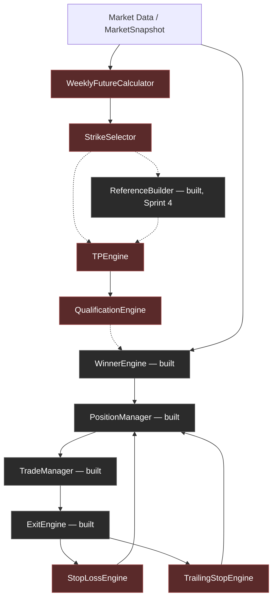

# Business Dependency Map

Dependency relationships among the six blocked business modules and the already-built framework packages. "Verified" below means checked directly against actual imports/constructor signatures in `src/`, not inferred from design documents.

## Graph

Solid edges = verified real dependency (a concrete type or call today, or an already-implemented integration). Dotted edges = expected dependency once implemented, but **not yet wired in code** — either because the consumer is itself still a stub, or because (per `BUSINESS_ARCHITECTURE.md` §3–4) the actual wiring mechanism (direct call vs. event) is undecided.

## Verified today

- `ExitEngine` **already imports and constructor-injects** `StopLossEngine` and `TrailingStopEngine` (`src/exit_engine/exit_engine.py`) and calls `.check()` on both every `evaluate()` cycle. This is the only one of the six modules with a fully wired, tested call-site today.
- `WinnerEngine`, `PositionManager`, `TradeManager`, `ExitEngine`, `ReferenceBuilder` have zero import dependency on any of the six blocked modules' concrete implementations — only on their Protocol types where applicable (`ExitEngine`'s constructor parameters are typed as `StopLossEngine`/`TrailingStopEngine` Protocols). This confirms the framework was deliberately built so the six modules can be dropped in without touching consumer code — the design goal stated across `BUSINESS_RULE_INTEGRATION_GUIDE.md` holds up on inspection.

## Not yet verified / not yet built

- `StrikeSelector → ReferenceBuilder`: `ReferenceBuilder` as tested today takes strike values directly from test fixtures/callers, not from a live `StrikeSelector` output. The dependency is architecturally expected (Spec Rule 1 centers the 13-level ladder on Top/Bottom Strike) but no code path connects them yet.
- `StrikeSelector`/`TPEngine → WinnerEngine`: **no dependency exists in code at all.** `WinnerEngine.evaluate()` takes CE/PE `MarketSnapshot`s directly. Whether Winner detection should ever consume `TPEngine`/`QualificationEngine` output is an open integration design question (also flagged in `BUSINESS_ARCHITECTURE.md` and `BUSINESS_SEQUENCE_DIAGRAM.md`), not confirmed by any evidence.
- `WeeklyFutureCalculator → StrikeSelector`: type-level dependency exists (`StrikeSelector.select()` takes a `WeeklyFuture` parameter) but no runtime wiring (event subscription or orchestrator) connects the two today; both are invoked as free-standing stubs.

## Circular-dependency check

Consistent with this project's standing verification step, the six blocked modules' Protocol definitions (`src/interfaces/`) import only `core`/`models` types — no interface imports another interface or any concrete built package. Adding real implementations under new `src/<module>/` packages (mirroring `weekly_future/`, `strike_selector/`, etc., per `BUSINESS_RULE_INTEGRATION_GUIDE.md`) will not introduce a cycle as long as each new package continues to depend only downward (`core`, `models`, `interfaces`) and never imports a sibling business-module package directly — the same rule already followed by `exit_engine`, `position_manager`, etc.
