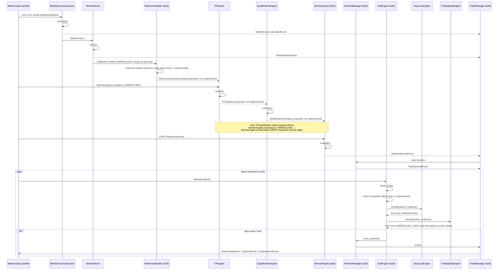

# Business Sequence Diagram

Companion to `BUSINESS_ARCHITECTURE.md`. Shows how the six blocked modules would interact end-to-end once implemented, layered onto the already-built framework. Solid arrows/labels mark events that exist today in `src/core/events.py`; dashed arrows/labels marked *(proposed)* mark events named only in `research/architecture/EVENT_CATALOG.md`, not yet implemented anywhere.

No timing, ordering-within-tick, or trigger cadence shown here is a resolved business rule — sequencing is drawn as a structural sketch of dependency order only, per the already-known dependency chain (`WeeklyFuture → StrikeSelector → ReferenceBuilder/TPEngine → QualificationEngine → WinnerEngine → PositionManager → ExitEngine`), not as a claim about real-time behavior.

## Notes

- `WFC`/`SS`/`TPE`/`QE`/`SLE`/`TSE` boxes represent Protocol stubs today (`UnresolvedBusinessRuleError` on any real call) — the diagram shows the *shape* of interaction once implemented, not current runtime behavior.
- The `RB → TPE` and `TPE → QE → WE` links are drawn dashed because the events they'd travel on don't exist in code, **and** because no evidence describes whether this path is event-driven at all versus directly invoked (matching how `WFC`/`SS` are invoked directly today rather than via bus subscription).
- The `EE` loop, `SLE`/`TSE` call shape, and the transitive `TradeClosedEvent` publish path are drawn solid/direct because they are real, already-built, already-tested code — only the boolean *logic inside* `SLE.check()`/`TSE.check()` is unresolved.
