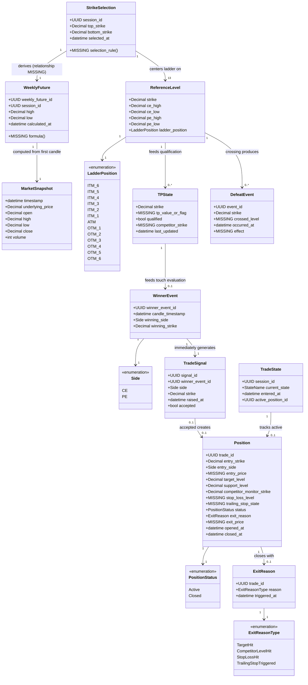
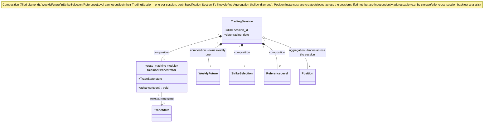
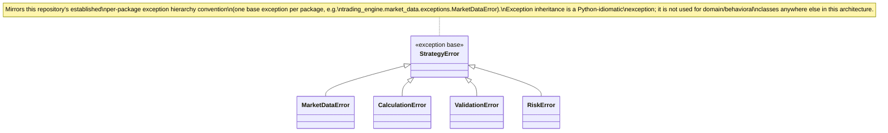
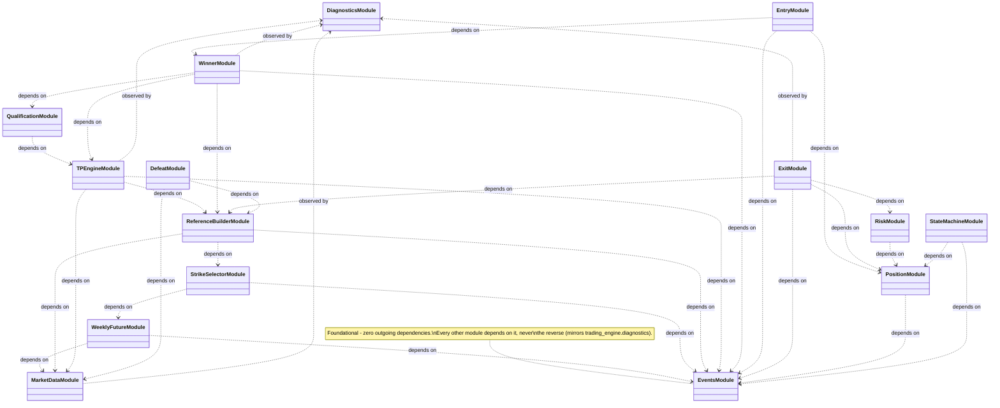

# Class Diagram

Phase 2 (System Architecture) deliverable. UML class diagrams (Mermaid
`classDiagram`) for the objects in `DATA_DICTIONARY.md` and the
modules in `MODULE_ARCHITECTURE.md`. Design-only — no Python code.
Fields shown as `MISSING` correspond exactly to **MISSING INFORMATION**
markers in `research/specification/STRATEGY_FUNCTIONAL_SPECIFICATION.md`
v1.1; they are included in the diagrams for completeness (a reader
should see the full intended shape of each class) but must not be
treated as resolved.

---

## 1. Core Domain Classes

---

## 2. Module Interfaces (Protocols)

Following this repository's established pattern (`typing.Protocol`,
structural typing — see `trading_engine.diagnostics.sink.DiagnosticsSink`,
`trading_engine.market_data.upstox_provider.RestTransport`), every
module in `MODULE_ARCHITECTURE.md` exposes a Protocol interface. Shown
here as UML interfaces; no implementation.

```mermaid
classDiagram
    class IWeeklyFutureCalculator {
        <<interface>>
        +calculate(candle) WeeklyFuture
    }

    class IStrikeSelector {
        <<interface>>
        +select(weekly_future) StrikeSelection
    }

    class IReferenceLevelBuilder {
        <<interface>>
        +build(strikes, candle_data) tuple~ReferenceLevel~
    }

    class ITPEngine {
        <<interface>>
        +update(snapshot, levels) TPState
    }

    class IQualificationEvaluator {
        <<interface>>
        +evaluate(tp_state) bool
    }

    class IWinnerEngine {
        <<interface>>
        +evaluate(snapshot, levels) WinnerEvent
    }

    class IEntryEngine {
        <<interface>>
        +try_enter(winner_event, current_position) TradeSignal
    }

    class IExitEngine {
        <<interface>>
        +evaluate(position, snapshot, levels) ExitReason
    }

    class IPositionManager {
        <<interface>>
        +open(signal) Position
        +close(position, reason) Position
        +active() Position
    }

    class IRiskEvaluator {
        <<interface>>
        +check_stop_loss(position, snapshot) bool
        +check_trailing_stop(position, snapshot) bool
    }

    class IDefeatDetector {
        <<interface>>
        +detect(snapshot, levels) DefeatEvent
    }

    class IMarketDataProvider {
        <<interface>>
        +subscribe(instrument) MarketSnapshot
        +get_first_five_minute_candle(instrument) MarketSnapshot
    }

    class IEventBus {
        <<interface>>
        +publish(event) void
        +subscribe(event_type, handler) void
    }

    class IDiagnosticsSink {
        <<interface>>
        +emit(event) void
    }

    class IRepository~T~ {
        <<interface>>
        +save(entity) void
        +load(id) T
    }
```

---

## 3. Composition / Aggregation Detail

---

## 4. Inheritance — Used Only Where Necessary

Per instruction 9 (single responsibility) and this repository's own
established convention (`typing.Protocol` over inheritance
hierarchies — see `docs/architecture/PYTHON_IMPLEMENTATION_GUIDE.md`'s
existing preference, reflected throughout `trading_engine/`), this
architecture uses **composition and Protocol interfaces almost
everywhere**. The one place inheritance is structurally justified:

No other inheritance hierarchy is proposed. `ExitReasonType`,
`PositionStatus`, `Side`, `LadderPosition` are enumerations, not
inheritance; every engine module (`ITPEngine`, `IWinnerEngine`, etc.)
is a Protocol interface with independent implementations, not a class
hierarchy.

---

## 5. Dependency Relationships (Module-Level, UML View)

---

## 6. Consolidated MISSING INFORMATION (Class Diagram Scope)

Every field marked `MISSING` in Section 1's class diagram corresponds
1:1 to a `STRATEGY_FUNCTIONAL_SPECIFICATION.md` Section 20 item:
`WeeklyFuture` formula, `StrikeSelection` rule, `TPState.tp_value_or_flag`/`.competitor_strike`,
`Position.entry_price`/`.stop_loss_level`/`.trailing_stop_state`/`.exit_price`,
`DefeatEvent.crossed_level`/`.effect`. None are resolved by this
document.
