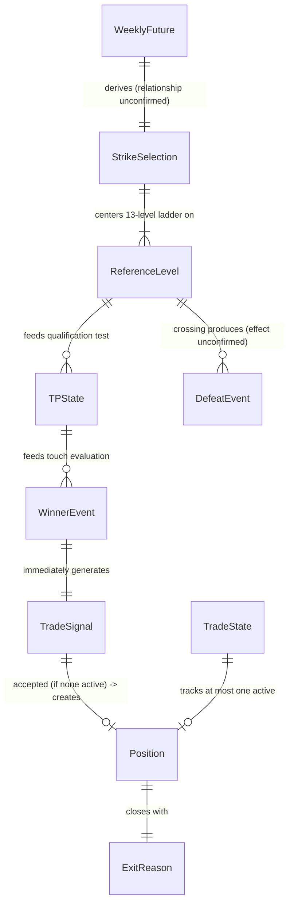

# Data Dictionary

Phase 2 (System Architecture) deliverable. Every object traces to
`research/specification/STRATEGY_FUNCTIONAL_SPECIFICATION.md` v1.1
("the Specification"). Fields the Specification does not define are
marked **MISSING INFORMATION** rather than typed/assumed. Where this
repository already has an implemented, structurally similar object
(from Milestones 4.x/I1/I2), it is cross-referenced for architectural
consistency — never merged or assumed identical without your
confirmation, per the Specification's own Section 20 reconciliation
notes.

---

## 1. `MarketSnapshot`

- **Purpose:** A point-in-time observation of market data feeding the engines (candle or tick — cadence unresolved, see below).
- **Fields:**

  | Field | Type | Nullable | Validation | Notes |
  |---|---|---|---|---|
  | `timestamp` | datetime | No | Not None | — |
  | `underlying_price` | Decimal | No | > 0 | — |
  | `candle_open` / `high` / `low` / `close` | Decimal | Yes (tick mode) | high ≥ low; open/close within [low, high] | Only populated if candle-based; see MISSING INFORMATION below |
  | `volume` | int | Yes | ≥ 0 | — |

- **Validation:** OHLC consistency (high ≥ low, open/close within range) if candle-based, mirroring the existing `trading_engine.replay.history_loader.Candle` validation pattern in this repository.
- **Relationships:** Feeds `TPState`, `WinnerEvent`, `ReferenceLevel` touch evaluation.
- **Lifecycle:** Ephemeral — one instance per observed candle/tick; not persisted as a standalone entity (persisted only as part of a `MarketRecorder`-style tick log, see the already-implemented `trading_engine/premium_snapshot/market_recorder.py`).
- **MISSING INFORMATION:** whether the engines operate on candles or ticks after 09:21 AM (Specification Section 20 item 7); this affects whether `MarketSnapshot` is candle-shaped or tick-shaped in the final implementation.

---

## 2. `WeeklyFuture`

- **Purpose:** The session's Weekly Future High and Low (Specification Section 4).
- **Fields:**

  | Field | Type | Nullable | Validation | Notes |
  |---|---|---|---|---|
  | `weekly_future_id` | UUID | No | Not None | — |
  | `session_id` | UUID | No | Not None | — |
  | `high` | Decimal | No | Formula MISSING INFORMATION | — |
  | `low` | Decimal | No | Formula MISSING INFORMATION | Relationship to `high` (e.g. low < high) cannot be validated until the formula is known |
  | `calculated_at` | datetime | No | = first 5-min candle completion, 09:20 (CONFIRMED, Spec Rule 1) | — |

- **Validation:** **MISSING INFORMATION** — cannot express a `high ≥ low` invariant (or any other) without the formula; a prior evidence source in this repository (`research/analysis/WEEKLY_FUTURE_VERIFICATION.md`) found a *different* Weekly Future worked example where Low exceeded High, underscoring that this invariant must not be assumed.
- **Relationships:** Feeds `StrikeSelection` (Top/Bottom Strike derivation — relationship itself unconfirmed, see `StrikeSelection` below).
- **Lifecycle:** Created once per session at 09:20; whether it is recalculated intraday is **MISSING INFORMATION** (Specification Section 20 item 16).

---

## 3. `StrikeSelection`

- **Purpose:** The session's Top Strike and Bottom Strike (both "ATM," Specification Section 5).
- **Fields:**

  | Field | Type | Nullable | Validation | Notes |
  |---|---|---|---|---|
  | `session_id` | UUID | No | Not None | — |
  | `top_strike` | Decimal | No | Selection rule MISSING INFORMATION | — |
  | `bottom_strike` | Decimal | No | Selection rule MISSING INFORMATION | Whether it can equal `top_strike` is unconfirmed |
  | `selected_at` | datetime | No | — | — |

- **Validation:** **MISSING INFORMATION** — no rounding or ATM-basis rule exists to validate against.
- **Relationships:** Derived from `WeeklyFuture` (exact relationship unconfirmed); feeds `ReferenceLevel` ladder generation (ladder is centered on these strikes).
- **Lifecycle:** Created once per session, immediately after `WeeklyFuture`; whether re-evaluated intraday is **MISSING INFORMATION**.

---

## 4. `ReferenceLevel`

- **Purpose:** One of the 13 strike-ladder levels (6 ITM, 1 ATM, 6 OTM), each carrying CE/PE High/Low reference values (Specification Section 6).
- **Fields:**

  | Field | Type | Nullable | Validation | Notes |
  |---|---|---|---|---|
  | `strike` | Decimal | No | > 0 | — |
  | `ce_high` | Decimal | No | ≥ `ce_low`; **CONFIRMED source: first 5-min candle (09:15–09:20) High of the CE contract** (Spec Rule 1) | — |
  | `ce_low` | Decimal | No | ≤ `ce_high`; **CONFIRMED source: same candle's Low** | — |
  | `pe_high` | Decimal | No | ≥ `pe_low`; **CONFIRMED source: same candle, PE contract's High** | — |
  | `pe_low` | Decimal | No | ≤ `pe_high`; **CONFIRMED source: same candle, PE contract's Low** | — |
  | `ladder_position` | enum {ITM-6..ITM-1, ATM, OTM-1..OTM-6} | No | Exactly 13 levels per ladder | Ladder step size beyond the 50-point example is MISSING INFORMATION |

- **Validation:** CE/PE High ≥ Low is a structurally sound invariant (mirrors this repository's existing `trading_engine.premium_snapshot.premium_snapshot_models.ContractSnapshot` validation), and is the one confirmed cross-field rule here.
- **Relationships:** 13 instances per session ladder, indexed by `strike`; referenced by `Trade.target_level`/`support_level`/`competitor_monitor_strike` (via the strike-offset rules in Specification Rule 2).
- **Lifecycle:** Created once, from the first 5-minute candle; whether held fixed for the session or recalculated is **MISSING INFORMATION** (Specification Section 20 item 17).
- **Cross-reference note:** structurally similar to the already-implemented `trading_engine.premium_snapshot.premium_snapshot_models.ContractSnapshot` (Milestone I2), which independently captures first-5-minute-candle OHLC per contract. Not assumed to be the same object without your confirmation (Specification Section 20 item 19).

---

## 5. `TPState`

- **Purpose:** The continuously-updating TP High / TP Low qualification state for Top Strike / Bottom Strike (Specification Section 7).
- **Fields:**

  | Field | Type | Nullable | Validation | Notes |
  |---|---|---|---|---|
  | `strike` | Decimal | No | Must be `top_strike` or `bottom_strike` | — |
  | `tp_value_or_flag` | MISSING INFORMATION | — | — | Whether TP is a price, a boolean, or both is unresolved (Specification Section 20 item 13) |
  | `qualified` | bool | No | Sustain test per Spec Section 7 | — |
  | `competitor_strike` | MISSING INFORMATION | — | — | Competitor identity for TP qualification specifically (not the Exit Engine's now-confirmed mapping) is unresolved (Specification Section 20 item 3, Critical) |
  | `last_updated` | datetime | No | — | Update cadence (tick/candle) is MISSING INFORMATION |

- **Validation:** **MISSING INFORMATION** in full — no numeric definition of "TP" exists to validate.
- **Relationships:** One instance per Top Strike, one per Bottom Strike; feeds `WinnerEvent` detection.
- **Lifecycle:** Created at `ReferenceLevelsGenerated`; updated continuously from 09:21 AM; recalculated after every `TradeClosed` per Specification Rule 5.

---

## 6. `Qualification`

- **Purpose:** The boolean sustain/breach outcome referenced by `TPState.qualified` above (Specification Sections 7–8). Modeled as a nested value rather than a separate top-level entity, since the Specification does not clearly separate "TP" and "Qualification" into two distinct concepts (Specification Section 8's own note).
- **Fields:**

  | Field | Type | Nullable | Validation | Notes |
  |---|---|---|---|---|
  | `strike` | Decimal | No | — | — |
  | `qualified` | bool | No | — | — |
  | `evaluated_at` | datetime | No | — | — |

- **Validation:** N/A beyond the fields above.
- **Relationships:** Embedded in `TPState`.
- **Lifecycle:** Re-evaluated on every `TPUpdated` cycle.
- **MISSING INFORMATION:** external-invalidation detection (news/budget/war/disaster, Specification Section 7) — no field represents this because no detection mechanism exists.

---

## 7. `WinnerEvent`

- **Purpose:** Records that a CE and a PE touched their reference levels in the same candle, and which side won (Specification Section 9).
- **Fields:**

  | Field | Type | Nullable | Validation | Notes |
  |---|---|---|---|---|
  | `winner_event_id` | UUID | No | Not None | — |
  | `candle_timestamp` | datetime | No | Candle timeframe MISSING INFORMATION | — |
  | `winning_side` | enum {CE, PE} | No | — | **CONFIRMED (Spec Rule 3): exactly one winner, no tie-break needed** |
  | `winning_strike` | Decimal | No | — | — |

- **Validation:** No cross-field invariant needed given Rule 3's confirmation that ambiguous simultaneous wins do not occur.
- **Relationships:** Produced by evaluating all `ReferenceLevel`/`TPState` instances against a `MarketSnapshot`; consumed by `TradeSignal`.
- **Lifecycle:** One instance per Winner determination; immediately followed by a `TradeSignal` (Specification: "Winner immediately generates Entry Signal").
- **MISSING INFORMATION:** whether "CE" and "PE" evaluated for touch are Top Strike's only, or every strike's, is unresolved (Specification Section 9's own "Trigger condition" gap).

---

## 8. `TradeSignal`

- **Purpose:** The Entry Signal raised immediately after a `WinnerEvent` (Specification Section 10).
- **Fields:**

  | Field | Type | Nullable | Validation | Notes |
  |---|---|---|---|---|
  | `signal_id` | UUID | No | Not None | — |
  | `winner_event_id` | UUID | No | FK → `WinnerEvent` | — |
  | `side` | enum {CE, PE} | No | = `WinnerEvent.winning_side` | — |
  | `strike` | Decimal | No | = `WinnerEvent.winning_strike` | — |
  | `raised_at` | datetime | No | — | — |
  | `accepted` | bool | No | False if a trade was already active (Spec Rule 4, CONFIRMED) | — |

- **Validation:** `accepted = False` implies no `Position` is created from this signal — the ignored-signal rule is a confirmed business rule (Rule 4), not a gap.
- **Relationships:** Produced from `WinnerEvent`; consumed by `Position` (if accepted).
- **Lifecycle:** Ephemeral — evaluated once, either accepted (→ `Position`) or discarded, per Rule 4.

---

## 9. `Position` (Trade)

- **Purpose:** The single active trade (Specification Section 10: "Only ONE trade may remain active").
- **Fields:**

  | Field | Type | Nullable | Validation | Notes |
  |---|---|---|---|---|
  | `trade_id` | UUID | No | Not None | — |
  | `entry_strike` | Decimal | No | = S (Spec Rule 2) | — |
  | `entry_side` | enum {CE, PE} | No | — | — |
  | `entry_price` | MISSING INFORMATION | — | — | Order type/price basis unstated |
  | `target_level` | Decimal | No | CE(S+1) if CE, PE(S-1) if PE — **CONFIRMED (Spec Rule 2)** | — |
  | `support_level` | Decimal | No | CE(S-1) if CE, PE(S+1) if PE — **CONFIRMED (Spec Rule 2)** | — |
  | `competitor_monitor_strike` | Decimal | No | PE(S-1) if CE, CE(S+1) if PE — **CONFIRMED (Spec Rule 2)** | Which of the competitor's own High/Low triggers exit is MISSING INFORMATION |
  | `stop_loss_level` | MISSING INFORMATION | — | — | Entire SL rule unstated (Critical gap) |
  | `trailing_stop_state` | MISSING INFORMATION | — | — | Activation/step mechanics unstated |
  | `status` | enum {Active, Closed} | No | Exactly one `Active` `Position` system-wide (Spec Section 10, CONFIRMED) | — |
  | `exit_reason` | `ExitReason` (see below) | Yes | Null while `status = Active` | — |
  | `exit_price` | MISSING INFORMATION | — | — | Not stated |
  | `opened_at` | datetime | No | — | — |
  | `closed_at` | datetime | Yes | Null while `status = Active` | — |

- **Validation:** At most one `Position` with `status = Active` at any time — the single most important system-wide invariant in this document, directly from Specification Section 10.
- **Relationships:** Created from an accepted `TradeSignal`; produces exactly one `ExitReason` on close.
- **Lifecycle:** `Active` → `Closed`, one-way, no reopening. A new `Position` cannot be created while one is `Active` (Rule 4).

---

## 10. `ExitReason`

- **Purpose:** Records which exit condition closed a `Position` (Specification Section 11).
- **Fields:**

  | Field | Type | Nullable | Validation | Notes |
  |---|---|---|---|---|
  | `trade_id` | UUID | No | FK → `Position` | — |
  | `reason` | enum {TargetHit, CompetitorLevelHit, StopLossHit, TrailingStopTriggered} | No | Exactly one value — precedence when multiple conditions are met simultaneously is MISSING INFORMATION | — |
  | `triggered_at` | datetime | No | — | — |

- **Validation:** Enum is closed to the four named conditions; no fifth reason exists per the Specification.
- **Relationships:** One-to-one with a closed `Position`.
- **Lifecycle:** Created at the moment of exit, immutable thereafter.

---

## 11. `TradeState`

- **Purpose:** The overall session-level state, mirroring `STATE_MACHINE.md`'s state list — tracks which state the engine is currently in, independent of any single `Position`.
- **Fields:**

  | Field | Type | Nullable | Validation | Notes |
  |---|---|---|---|---|
  | `session_id` | UUID | No | Not None | — |
  | `current_state` | enum (see `STATE_MACHINE.md` Section 1) | No | Must be a valid state per the FSM | — |
  | `entered_at` | datetime | No | — | — |
  | `active_position_id` | UUID | Yes | Non-null only in `TradeActive`-family states | — |

- **Validation:** `current_state` transitions must follow `STATE_MACHINE.md`'s Mermaid diagram exactly; no shortcut transitions.
- **Relationships:** References at most one `Position` at a time.
- **Lifecycle:** One instance per session, mutated in place as the state machine advances; never deleted mid-session.

---

## 12. `DefeatEvent`

- **Purpose:** Records that a strike crossed a reference level (Specification Section 14).
- **Fields:**

  | Field | Type | Nullable | Validation | Notes |
  |---|---|---|---|---|
  | `event_id` | UUID | No | Not None | — |
  | `strike` | Decimal | No | — | — |
  | `crossed_level` | MISSING INFORMATION | — | — | Which level was crossed is unstated |
  | `occurred_at` | datetime | No | — | — |
  | `effect` | MISSING INFORMATION | — | — | Entire operational consequence unstated (Critical gap, Specification Section 20 item 5) |

- **Validation:** **MISSING INFORMATION** in full.
- **Relationships:** **MISSING INFORMATION** — no confirmed relationship to `TPState`, `Position`, or `WinnerEvent`.
- **Lifecycle:** **MISSING INFORMATION** — cannot be specified until Section 14's operational effect is defined.

---

## 13. `TrendPoint` — Not Evidenced

The document outline names `TrendPoint` as an example object, but no rule in `STRATEGY_FUNCTIONAL_SPECIFICATION.md` v1.1 mentions a trend concept. Note that this repository's *unrelated* Phase 4/5 work (`trading_engine.domain.trend_point.TrendPoint`) already defines a `TrendPoint` entity for a *different* evidence source (`TR-001.md`'s TREND-001/002/003 rules) — this document does not reuse or alias that entity, since nothing in the Specification this document is based on establishes a Trend concept. **MISSING INFORMATION: whether this strategy has a Trend concept at all is unconfirmed** — flagged rather than assumed.

---

## 14. Entity-Relationship Overview

---

## 15. Consolidated MISSING INFORMATION (Data Dictionary Scope)

- `WeeklyFuture.high`/`.low` formula and cross-field invariant.
- `StrikeSelection` selection rule and rounding basis.
- `TPState.tp_value_or_flag` type; `TPState.competitor_strike` identity rule.
- `Position.entry_price`/`.exit_price` basis; `Position.stop_loss_level`; `Position.trailing_stop_state` mechanics.
- `ExitReason` precedence rule when multiple conditions fire simultaneously.
- `DefeatEvent.crossed_level` and `.effect` — the entire object's operational meaning.
- Whether a `TrendPoint`-equivalent entity exists for this strategy at all.

These mirror `STRATEGY_FUNCTIONAL_SPECIFICATION.md` Section 20 exactly — no new gap is introduced by this document, and none of the above should be resolved here.
