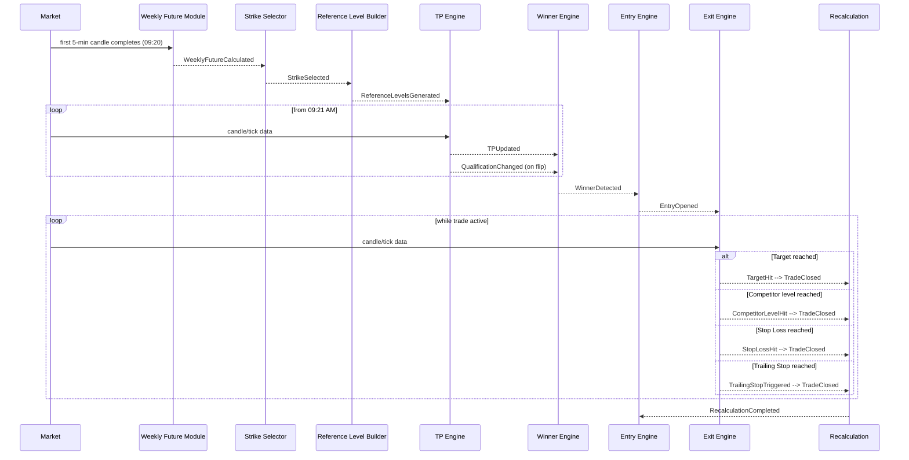

# Event Catalog

Phase 2 (System Architecture) deliverable. Event-driven architecture
per user requirement — every engine communicates via events, mirroring
the pattern already established in this codebase's
`trading_engine/diagnostics/` package (frozen dataclass events, a
single `DiagnosticsSink`-style consumer contract) but scoped here to
**domain/strategy events**, not diagnostics. No business rule is
invented; every payload field and trigger condition traces to
`research/specification/STRATEGY_FUNCTIONAL_SPECIFICATION.md` v1.1
("the Specification"), with gaps marked **MISSING INFORMATION**.

---

## 1. Event List

| # | Event | Raised by (state, per `STATE_MACHINE.md`) |
|---|---|---|
| 1 | `WeeklyFutureCalculated` | `WeeklyFutureCalculated` |
| 2 | `StrikeSelected` | `StrikeSelected` |
| 3 | `ReferenceLevelsGenerated` | `ReferenceLevelsGenerated` |
| 4 | `TPUpdated` | `TPUpdating` |
| 5 | `QualificationChanged` | `Qualification` |
| 6 | `DefeatDetected` | (cross-cutting — see note in Section 2.6) |
| 7 | `WinnerDetected` | `WinnerFound` |
| 8 | `EntryOpened` | `Entry` |
| 9 | `TargetHit` | `TargetHit` |
| 10 | `CompetitorLevelHit` | `CompetitorExit` |
| 11 | `StopLossHit` | `StopLoss` |
| 12 | `TrailingStopTriggered` | `TrailingStop` |
| 13 | `TradeClosed` | `Exit` |
| 14 | `RecalculationCompleted` | `Recalculation` |

---

## 2. Event Specifications

### 2.1 `WeeklyFutureCalculated`

- **Description:** Weekly Future High and Weekly Future Low have been computed for the session.
- **Publisher:** Weekly Future module (`weekly_future/`, see `MODULE_ARCHITECTURE.md`).
- **Subscribers:** Strike Selector module; Diagnostics/Storage (for audit trail).
- **Payload:**

  | Field | Type | Nullable | Notes |
  |---|---|---|---|
  | `event_id` | UUID | No | — |
  | `occurred_at` | datetime | No | — |
  | `session_id` | UUID | No | — |
  | `weekly_future_high` | Decimal | No | Formula MISSING INFORMATION (Spec Section 4) |
  | `weekly_future_low` | Decimal | No | Formula MISSING INFORMATION (Spec Section 4) |

- **Trigger Conditions:** First 5-minute candle (09:15–09:20, Spec Rule 1) completes and the Weekly Future computation succeeds.
- **Event Sequence:** First event in the session lifecycle after `Waiting`.
- **Event Priority:** N/A (single producer, no concurrent competing event at this stage).
- **Recovery Behaviour:** **MISSING INFORMATION** — the Specification does not describe what happens if the Weekly Future computation fails (e.g. missing candle data). No retry/fallback event is modeled.

### 2.2 `StrikeSelected`

- **Description:** Top Strike and Bottom Strike (both "ATM") have been selected.
- **Publisher:** Strike Selector module.
- **Subscribers:** Reference Level Builder module; Diagnostics/Storage.
- **Payload:**

  | Field | Type | Nullable | Notes |
  |---|---|---|---|
  | `event_id` | UUID | No | — |
  | `occurred_at` | datetime | No | — |
  | `session_id` | UUID | No | — |
  | `top_strike` | Decimal | No | Selection rule MISSING INFORMATION (Spec Section 5) |
  | `bottom_strike` | Decimal | No | Selection rule MISSING INFORMATION (Spec Section 5) |

- **Trigger Conditions:** `WeeklyFutureCalculated` consumed, ATM selection rule applied.
- **Event Sequence:** After `WeeklyFutureCalculated`.
- **Event Priority:** N/A.
- **Recovery Behaviour:** **MISSING INFORMATION** — no failure path specified (e.g. if Top Strike and Bottom Strike resolve to the same value, Spec Section 5's own open question).

### 2.3 `ReferenceLevelsGenerated`

- **Description:** The 13-level strike ladder is built; each level's CE High/Low, PE High/Low are populated from the first 5-minute candle (Spec Rule 1, CONFIRMED).
- **Publisher:** Reference Level Builder module.
- **Subscribers:** TP Engine; Winner Engine; Exit Engine (reads levels for Target/Support/Competitor mapping); Diagnostics/Storage.
- **Payload:**

  | Field | Type | Nullable | Notes |
  |---|---|---|---|
  | `event_id` | UUID | No | — |
  | `occurred_at` | datetime | No | — |
  | `session_id` | UUID | No | — |
  | `levels` | list of `ReferenceLevel` (see `DATA_DICTIONARY.md`) | No, 13 entries | Ladder step size beyond the 50-point example is MISSING INFORMATION (Spec Section 20 item 14) |

- **Trigger Conditions:** `StrikeSelected` consumed, all 13 levels' CE/PE High/Low populated from the confirmed first-5-minute-candle source.
- **Event Sequence:** After `StrikeSelected`, before `TPUpdated` begins.
- **Event Priority:** N/A.
- **Recovery Behaviour:** **MISSING INFORMATION** — no failure path specified (e.g. a strike in the ladder has no tradable contract).

### 2.4 `TPUpdated`

- **Description:** The TP Engine's continuous update cycle has produced a new TP High / TP Low value for Top Strike / Bottom Strike (Spec Section 7).
- **Publisher:** TP Engine module.
- **Subscribers:** Qualification sub-component (same module, internal); Winner Engine; Diagnostics/Storage.
- **Payload:**

  | Field | Type | Nullable | Notes |
  |---|---|---|---|
  | `event_id` | UUID | No | — |
  | `occurred_at` | datetime | No | — |
  | `session_id` | UUID | No | — |
  | `strike` | Decimal | No | Top Strike or Bottom Strike |
  | `tp_value_or_flag` | MISSING INFORMATION | — | Whether TP is a price, boolean flag, or both is unresolved (Spec Section 20 item 13) |
  | `competitor_strike` | MISSING INFORMATION | — | Competitor identity for TP qualification is unresolved (Spec Section 20 item 3, Critical) |

- **Trigger Conditions:** Continuous from 09:21 AM (Spec Section 7). Update cadence (tick vs. candle) is **MISSING INFORMATION** (Spec Section 20 item 12).
- **Event Sequence:** Repeating, from `ReferenceLevelsGenerated` until `WinnerDetected` or session end.
- **Event Priority:** Highest-frequency event in the catalogue; must not block `WinnerDetected` evaluation.
- **Recovery Behaviour:** **MISSING INFORMATION** — no described behavior for a missed/late update cycle.

### 2.5 `QualificationChanged`

- **Description:** A strike's TP qualification (sustaining vs. not sustaining against its competitor level) has flipped.
- **Publisher:** TP Engine module (Qualification sub-component).
- **Subscribers:** Winner Engine (informational); Diagnostics/Storage.
- **Payload:**

  | Field | Type | Nullable | Notes |
  |---|---|---|---|
  | `event_id` | UUID | No | — |
  | `occurred_at` | datetime | No | — |
  | `session_id` | UUID | No | — |
  | `strike` | Decimal | No | — |
  | `qualified` | bool | No | Sustain test per Spec Section 7 |
  | `previous_qualified` | bool | No | For change-detection audit |

- **Trigger Conditions:** A `TPUpdated` cycle changes the sustain/breach outcome relative to the prior cycle.
- **Event Sequence:** Derived from, and always follows, a `TPUpdated` event.
- **Event Priority:** Same as `TPUpdated`.
- **Recovery Behaviour:** **MISSING INFORMATION** — Spec Section 7 warns that news/budget/war/disaster "may invalidate any qualification" but specifies no detection mechanism; this event cannot represent that invalidation until one is defined.

### 2.6 `DefeatDetected`

- **Description:** A strike has crossed a reference level (Spec Section 14: "Defeat means any strike crosses any reference level").
- **Publisher:** Cross-cutting — logically belongs wherever price data is evaluated against reference levels (TP Engine and/or Winner Engine and/or Exit Engine); the Specification does not assign this to one engine, so publisher ownership is itself **MISSING INFORMATION**.
- **Subscribers:** **MISSING INFORMATION** — the Specification never states what, if anything, consumes this event or reacts to it (Spec Section 14, Section 20 item 5, Critical).
- **Payload:**

  | Field | Type | Nullable | Notes |
  |---|---|---|---|
  | `event_id` | UUID | No | — |
  | `occurred_at` | datetime | No | — |
  | `session_id` | UUID | No | — |
  | `strike` | Decimal | No | The strike that crossed a level |
  | `crossed_level` | MISSING INFORMATION | — | Which strike's/level's boundary was crossed is unstated |

- **Trigger Conditions:** Any strike crosses any reference level — trigger is stated, but scope ("any" — every strike vs. only the active ladder's strikes) is unconfirmed.
- **Event Sequence:** **MISSING INFORMATION** — could occur at any point from `ReferenceLevelsGenerated` onward; relationship to `WinnerDetected`/`TradeActive` is unstated (Spec Section 19's edge cases).
- **Event Priority:** **MISSING INFORMATION**.
- **Recovery Behaviour:** **MISSING INFORMATION** — this event's entire operational effect is undefined. It is included in this catalogue only because the Specification names the trigger condition; it should not be wired to any consumer behavior until Spec Section 20 item 5 is resolved.

### 2.7 `WinnerDetected`

- **Description:** A CE and a PE have both touched their own reference levels within the same candle; a winning side and strike have been determined (Spec Section 9).
- **Publisher:** Winner Engine module.
- **Subscribers:** Entry Engine; Diagnostics/Storage.
- **Payload:**

  | Field | Type | Nullable | Notes |
  |---|---|---|---|
  | `event_id` | UUID | No | — |
  | `occurred_at` | datetime | No | — |
  | `session_id` | UUID | No | — |
  | `candle_timestamp` | datetime | No | Candle timeframe post-09:21 is MISSING INFORMATION (Spec Section 20 item 7) |
  | `winning_side` | enum {CE, PE} | No | — |
  | `winning_strike` | Decimal | No | — |

- **Trigger Conditions:** Same-candle CE+PE touch of respective reference levels (Spec Section 9). Which strike(s)' CE/PE are evaluated is **MISSING INFORMATION**.
- **Event Sequence:** After one or more `TPUpdated`/`QualificationChanged` cycles.
- **Event Priority:** Must be evaluated before the next `TPUpdated` cycle to avoid missing the same-candle condition (implementation concern, not a Specification rule).
- **Recovery Behaviour:** **CONFIRMED (Spec Rule 3):** no tie-break/recovery logic is needed — the ambiguous multi-touch scenario does not occur.

### 2.8 `EntryOpened`

- **Description:** A trade has been opened immediately following `WinnerDetected` (Spec Section 10).
- **Publisher:** Entry Engine module.
- **Subscribers:** Exit Engine (begins monitoring); Position/Risk module; Diagnostics/Storage.
- **Payload:**

  | Field | Type | Nullable | Notes |
  |---|---|---|---|
  | `event_id` | UUID | No | — |
  | `occurred_at` | datetime | No | — |
  | `session_id` | UUID | No | — |
  | `trade_id` | UUID | No | — |
  | `entry_strike` | Decimal | No | = winning strike S (Spec Rule 2) |
  | `entry_side` | enum {CE, PE} | No | = winning side |
  | `entry_price` | MISSING INFORMATION | — | Order type/price basis unstated (Spec Section 11) |
  | `target_level` | Decimal | No | CE(S+1) or PE(S-1) per Spec Rule 2, CONFIRMED |
  | `support_level` | Decimal | No | CE(S-1) or PE(S+1) per Spec Rule 2, CONFIRMED |
  | `competitor_monitor_strike` | Decimal | No | PE(S-1) or CE(S+1) per Spec Rule 2, CONFIRMED |

- **Trigger Conditions:** `WinnerDetected` fires **and** no trade is currently active (Spec Rule 4).
- **Event Sequence:** Immediately after `WinnerDetected`.
- **Event Priority:** N/A (single trade at a time by design — see Section 3's ignored-signal note).
- **Recovery Behaviour:** If a trade is already active when `WinnerDetected` fires, **no `EntryOpened` event is raised at all** — the signal is explicitly ignored (Spec Rule 4: "Ignore all new entry signals until the active trade exits"), not queued, retried, or logged as an error. This is a confirmed rule, not a gap.

### 2.9 `TargetHit`

- **Description:** The active trade's Target reference level has been reached.
- **Publisher:** Exit Engine module.
- **Subscribers:** Position/Risk module; Diagnostics/Storage.
- **Payload:**

  | Field | Type | Nullable | Notes |
  |---|---|---|---|
  | `event_id` | UUID | No | — |
  | `occurred_at` | datetime | No | — |
  | `trade_id` | UUID | No | — |
  | `target_level` | Decimal | No | — |
  | `exit_price` | MISSING INFORMATION | — | Not stated |

- **Trigger Conditions:** Price reaches `target_level` (CE(S+1) or PE(S-1), Spec Rule 2, CONFIRMED).
- **Event Sequence:** During `TradeActive`.
- **Event Priority:** Mutually exclusive with `CompetitorLevelHit`/`StopLossHit`/`TrailingStopTriggered` — precedence when several fire together is **MISSING INFORMATION** (Spec Section 20 item 11).
- **Recovery Behaviour:** N/A — a terminal trigger; always leads to `TradeClosed`.

### 2.10 `CompetitorLevelHit`

- **Description:** The competitor strike's option has reached its own reference level (Spec Section 11).
- **Publisher:** Exit Engine module.
- **Subscribers:** Position/Risk module; Diagnostics/Storage.
- **Payload:**

  | Field | Type | Nullable | Notes |
  |---|---|---|---|
  | `event_id` | UUID | No | — |
  | `occurred_at` | datetime | No | — |
  | `trade_id` | UUID | No | — |
  | `competitor_strike` | Decimal | No | PE(S-1) or CE(S+1), Spec Rule 2, CONFIRMED |
  | `competitor_level_hit` | MISSING INFORMATION | — | Which of the competitor's own High/Low triggered this is unstated (Spec Section 20 item 8) |

- **Trigger Conditions:** Competitor option reaches "its own reference level" — specific level (High or Low) unconfirmed.
- **Event Sequence:** During `TradeActive`.
- **Event Priority:** Same precedence gap as `TargetHit`.
- **Recovery Behaviour:** N/A — terminal trigger; leads to `TradeClosed`.

### 2.11 `StopLossHit`

- **Description:** A Stop Loss condition has been reached.
- **Publisher:** Exit Engine module (or a dedicated Risk module — ownership is an architecture decision, not specified by the Specification).
- **Subscribers:** Position/Risk module; Diagnostics/Storage.
- **Payload:**

  | Field | Type | Nullable | Notes |
  |---|---|---|---|
  | `event_id` | UUID | No | — |
  | `occurred_at` | datetime | No | — |
  | `trade_id` | UUID | No | — |
  | `stop_loss_level` | MISSING INFORMATION | — | Entire SL rule unstated (Spec Section 11, Section 20 item 4, Critical) |

- **Trigger Conditions:** **MISSING INFORMATION** in full — no SL price, basis, or placement rule exists anywhere in the Specification.
- **Event Sequence:** During `TradeActive`, if/when the rule is defined.
- **Event Priority:** Same precedence gap as `TargetHit`.
- **Recovery Behaviour:** N/A — cannot be implemented until Spec Section 20 item 4 is resolved.

### 2.12 `TrailingStopTriggered`

- **Description:** A Trailing Stop condition has been reached, guaranteeing a minimum net +3 premium points after brokerage/exchange charges/tax (Spec Section 13).
- **Publisher:** Exit Engine module (or Risk module).
- **Subscribers:** Position/Risk module; Diagnostics/Storage.
- **Payload:**

  | Field | Type | Nullable | Notes |
  |---|---|---|---|
  | `event_id` | UUID | No | — |
  | `occurred_at` | datetime | No | — |
  | `trade_id` | UUID | No | — |
  | `trailing_stop_level` | MISSING INFORMATION | — | Activation trigger/step distance unstated (Spec Section 13) |
  | `net_premium_points` | Decimal | No | Must be ≥ +3 net (Spec Section 13, CONFIRMED minimum) |

- **Trigger Conditions:** Trail activation trigger and step/distance are **MISSING INFORMATION** (Spec Section 20 item 9). The minimum net-profit guarantee (+3 points after brokerage/exchange/tax) is confirmed, but brokerage/exchange/tax figures themselves are **MISSING INFORMATION** (Spec Section 20 item 10) — so the guarantee cannot be numerically evaluated yet.
- **Event Sequence:** During `TradeActive`.
- **Event Priority:** Same precedence gap as `TargetHit`.
- **Recovery Behaviour:** N/A — cannot be fully implemented until Spec Section 20 items 9–10 are resolved.

### 2.13 `TradeClosed`

- **Description:** The active trade has been closed, with an exit reason recorded.
- **Publisher:** Exit Engine module.
- **Subscribers:** Position/Risk module; Storage (trade history); Diagnostics; Recalculation trigger.
- **Payload:**

  | Field | Type | Nullable | Notes |
  |---|---|---|---|
  | `event_id` | UUID | No | — |
  | `occurred_at` | datetime | No | — |
  | `trade_id` | UUID | No | — |
  | `exit_reason` | enum {TargetHit, CompetitorLevelHit, StopLossHit, TrailingStopTriggered} | No | — |
  | `exit_price` | MISSING INFORMATION | — | Not stated |

- **Trigger Conditions:** Any one of `TargetHit`, `CompetitorLevelHit`, `StopLossHit`, `TrailingStopTriggered`.
- **Event Sequence:** Immediately follows whichever exit-condition event fired.
- **Event Priority:** N/A.
- **Recovery Behaviour:** Always leads to `RecalculationCompleted` per Spec Rule 5 — no failure path described.

### 2.14 `RecalculationCompleted`

- **Description:** TP, Qualification, and Winner have all been recomputed after a trade exit, and the engine is ready to accept the next trade (Spec Rule 5).
- **Publisher:** Recalculation module (or the TP Engine/Winner Engine reused in a "recalculate" mode — module ownership is an architecture decision).
- **Subscribers:** Entry Engine (unblocks next-trade acceptance); Diagnostics/Storage.
- **Payload:**

  | Field | Type | Nullable | Notes |
  |---|---|---|---|
  | `event_id` | UUID | No | — |
  | `occurred_at` | datetime | No | — |
  | `session_id` | UUID | No | — |
  | `previous_trade_id` | UUID | No | — |

- **Trigger Conditions:** `TradeClosed` consumed; TP/Qualification/Winner recomputation completes (Spec Rule 5, CONFIRMED as a required step, mechanics of "recompute Winner" against the in-progress vs. next candle are **MISSING INFORMATION**).
- **Event Sequence:** Last event in a trade cycle; the next `TPUpdated`/`WinnerDetected` cycle resumes afterward.
- **Event Priority:** N/A.
- **Recovery Behaviour:** **MISSING INFORMATION** — whether Weekly Future/Strike Selection/Reference Levels are regenerated as part of this recalculation, or only TP/Qualification/Winner as literally stated, is unresolved (Spec Section 20 item 16).

---

## 3. Event Sequence Diagram (Happy Path)

---

## 4. Event Priority Summary

| Priority tier | Events | Rationale |
|---|---|---|
| High-frequency, non-blocking | `TPUpdated`, `QualificationChanged` | Continuous updates; must not block Winner detection |
| Trade-critical, mutually exclusive | `TargetHit`, `CompetitorLevelHit`, `StopLossHit`, `TrailingStopTriggered` | Exactly one should apply per trade exit; precedence rule is **MISSING INFORMATION** |
| Gate events | `EntryOpened` | Guarded by the single-active-trade rule (Spec Rule 4, CONFIRMED) |
| Lifecycle/audit | `WeeklyFutureCalculated`, `StrikeSelected`, `ReferenceLevelsGenerated`, `WinnerDetected`, `TradeClosed`, `RecalculationCompleted` | Sequenced, one-shot per cycle |
| Undefined scope | `DefeatDetected` | Publisher, subscribers, and effect all **MISSING INFORMATION** — included for completeness only |

---

## 5. Recovery Behaviour — Consolidated Gaps

No event in this catalogue has a Specification-defined failure/retry/compensation path. Every "Recovery Behaviour" field above that is not explicitly a confirmed no-op (`EntryOpened`'s ignore rule) is **MISSING INFORMATION**. This should be resolved, or an explicit engineering default agreed with the domain owner, before Phase 13 (Diagnostics) of `IMPLEMENTATION_ROADMAP.md`.
