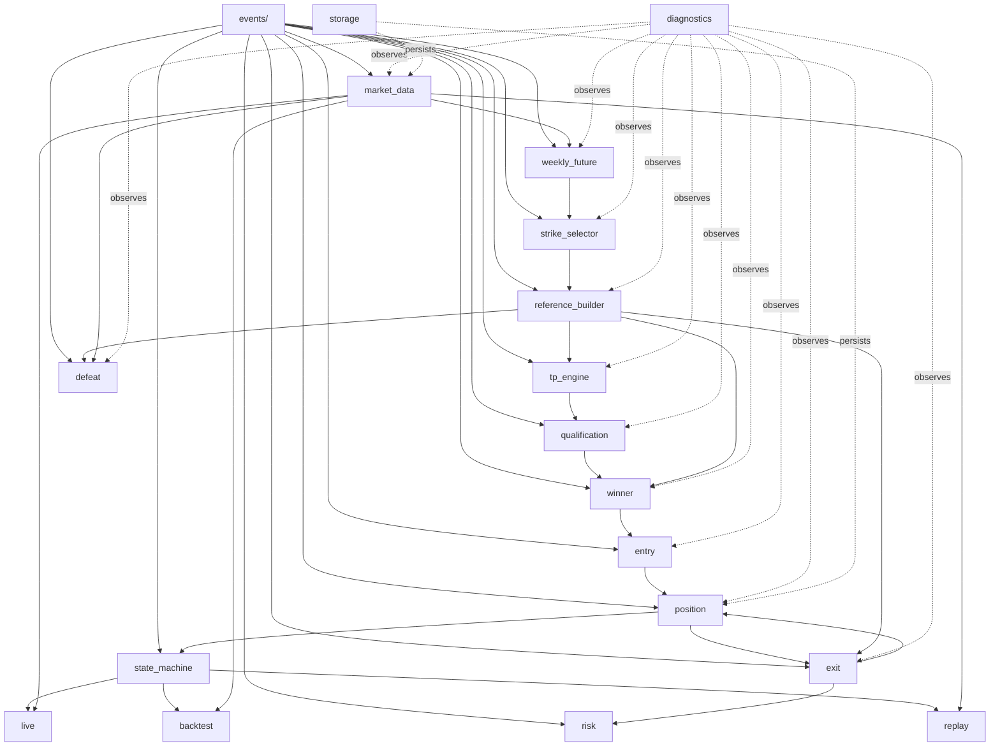

# Module Architecture

Phase 2 (System Architecture) deliverable. Package layout for the
strategy described in `research/specification/STRATEGY_FUNCTIONAL_SPECIFICATION.md`
v1.1 ("the Specification"). This is a **design document** — no code
is generated here (per instruction). Module boundaries follow the
single-responsibility principle and the event-driven contract defined
in `EVENT_CATALOG.md`.

**Relationship to the existing `trading_engine/` package:** this
repository already has an implemented, general-purpose framework
(`trading_engine/domain`, `rules`, `engine`, `calculators`,
`diagnostics`, `market_data`, `replay`, `premium_snapshot`) built
under a *different* evidence source (`TR-001.md`) for a *different,
unfinished* rule set (STRIKE-001, TREND-001-003, OPPONENT-001-003,
REVERSAL-001 — most still `NotImplementedError`). This document does
**not** assume the modules below reuse that framework's Rule/Calculator
classes — the Specification this document is based on is a separate,
self-contained rule set. Where a proposed module could plausibly reuse
existing infrastructure (e.g. `trading_engine.diagnostics`,
`trading_engine.market_data`), that is called out explicitly as a
**Phase 2 recommendation**, not a requirement, and remains subject to
your decision when Phase 3+ begins.

---

## 1. Top-Level Package Layout

```
strategy_engine/
    market_data/
    weekly_future/
    strike_selector/
    reference_builder/
    tp_engine/
    qualification/
    winner/
    entry/
    exit/
    position/
    risk/
    defeat/
    events/
    state_machine/
    replay/
    backtest/
    live/
    storage/
    diagnostics/
    tests/
```

**Naming note:** `trend_point/` from the user's example module list is
omitted — per `DATA_DICTIONARY.md` Section 13, no Trend concept is
evidenced anywhere in the Specification this architecture is based
on. Adding an empty module for an unevidenced concept would be
speculative; if a Trend concept is confirmed later, it can be added
without disrupting this layout.

---

## 2. Module Dependency Graph



`events/` is the foundational package — every other module depends on
it, it depends on nothing else, mirroring this repository's existing
`trading_engine.diagnostics` precedent (foundational, zero
dependencies, everything else depends on it, never the reverse).
`diagnostics/` observes every module without any module depending on
`diagnostics/` for its own logic — same precedent.

---

## 3. Per-Module Specification

### 3.1 `market_data/`

- **Responsibilities:** Ingest live/replayed price data (candles or ticks — cadence MISSING INFORMATION, Specification Section 20 item 7) and expose it as `MarketSnapshot` (see `DATA_DICTIONARY.md`).
- **Public API (conceptual):** `subscribe(instrument) -> Iterable[MarketSnapshot]`; `get_first_five_minute_candle(instrument) -> Candle`.
- **Dependencies:** `events/`.
- **Forbidden Dependencies:** Must not depend on `tp_engine/`, `winner/`, `entry/`, `exit/`, or any strategy-logic module — market data is a pure upstream source.
- **Inputs:** Broker/replay/backtest data feed (external).
- **Outputs:** `MarketSnapshot` stream; the first-5-minute-candle OHLC specifically (feeds `weekly_future/` and `reference_builder/`).
- **Recommendation:** the already-implemented `trading_engine/market_data/` (Milestone I1) and `trading_engine/premium_snapshot/` (Milestone I2) packages already solve most of this module's stated responsibility (broker connectivity, first-5-minute-candle OHLC capture per contract) for a different rule set. Reusing them here is a plausible Phase 4 decision, not assumed by this document.

### 3.2 `weekly_future/`

- **Responsibilities:** Compute Weekly Future High/Low at 09:20 AM from the first 5-minute candle (Specification Section 4).
- **Public API (conceptual):** `calculate(candle: Candle) -> WeeklyFuture`.
- **Dependencies:** `market_data/`, `events/`.
- **Forbidden Dependencies:** Must not depend on `strike_selector/`, `reference_builder/`, or anything downstream — a pure, one-directional calculation.
- **Inputs:** First 5-minute candle (09:15–09:20).
- **Outputs:** `WeeklyFuture` (Weekly Future High, Weekly Future Low); publishes `WeeklyFutureCalculated`.
- **MISSING INFORMATION:** the formula itself (Specification Section 20 item 1, Critical) — this module cannot be implemented beyond its interface shape until resolved.

### 3.3 `strike_selector/`

- **Responsibilities:** Select Top Strike and Bottom Strike (both "ATM") from `WeeklyFuture` (Specification Section 5).
- **Public API (conceptual):** `select(weekly_future: WeeklyFuture) -> StrikeSelection`.
- **Dependencies:** `weekly_future/`, `events/`.
- **Forbidden Dependencies:** Must not depend on `reference_builder/` or anything downstream.
- **Inputs:** `WeeklyFuture`.
- **Outputs:** `StrikeSelection`; publishes `StrikeSelected`.
- **MISSING INFORMATION:** ATM basis and rounding rule (Specification Section 20 item 2, Critical).

### 3.4 `reference_builder/`

- **Responsibilities:** Build the 13-level strike ladder and populate each level's CE/PE High/Low from the first 5-minute candle (Specification Section 6, Rule 1 — CONFIRMED source).
- **Public API (conceptual):** `build(strikes: StrikeSelection, candle_data: dict[Decimal, Candle]) -> tuple[ReferenceLevel, ...]`.
- **Dependencies:** `strike_selector/`, `market_data/`, `events/`.
- **Forbidden Dependencies:** Must not depend on `tp_engine/`, `winner/`, or anything downstream.
- **Inputs:** `StrikeSelection`; per-strike first-5-minute-candle CE/PE OHLC.
- **Outputs:** 13 `ReferenceLevel` instances; publishes `ReferenceLevelsGenerated`.
- **MISSING INFORMATION:** ladder step size beyond the 50-point example; ladder center (shared vs. per-strike); whether levels are held fixed or recalculated (Specification Section 20 items 14, 17).

### 3.5 `tp_engine/`

- **Responsibilities:** Continuously compute TP High (Top Strike)/TP Low (Bottom Strike) from 09:21 AM (Specification Section 7).
- **Public API (conceptual):** `update(snapshot: MarketSnapshot, levels: tuple[ReferenceLevel, ...]) -> TPState`.
- **Dependencies:** `reference_builder/`, `market_data/`, `events/`.
- **Forbidden Dependencies:** Must not depend on `winner/`, `entry/`, `exit/` — TP Engine only produces qualification state, it does not consume trade outcomes (except being re-invoked during `Recalculation`, an external orchestration concern, not an internal dependency).
- **Inputs:** `MarketSnapshot` stream, `ReferenceLevel` ladder.
- **Outputs:** `TPState` per Top/Bottom Strike; publishes `TPUpdated`.
- **MISSING INFORMATION:** competitor-strike identity for the qualification test (Critical); update cadence; whether TP is a price, flag, or both (Specification Section 20 items 3, 12, 13).

### 3.6 `qualification/`

- **Responsibilities:** Evaluate the sustain/breach test embedded in `tp_engine/`'s update cycle (Specification Sections 7–8).
- **Public API (conceptual):** `evaluate(tp_state: TPState) -> bool`.
- **Dependencies:** `tp_engine/`, `events/`.
- **Forbidden Dependencies:** Same as `tp_engine/`.
- **Inputs:** `TPState`.
- **Outputs:** Qualification boolean; publishes `QualificationChanged` on flip.
- **Design note:** modeled as a thin module wrapping `tp_engine/`'s own sustain test, per the Specification's own observation that "TP" and "Qualification" are not clearly separated (Section 8). Kept as a separate package only to honor the user's explicit module list and single-responsibility principle (isolating the sustain/flip-detection logic from the raw TP computation), not because the Specification describes two independent engines.
- **MISSING INFORMATION:** external-invalidation detection (news/budget/war/disaster).

### 3.7 `winner/`

- **Responsibilities:** Detect same-candle CE+PE touch of reference levels and determine the winning side/strike (Specification Section 9).
- **Public API (conceptual):** `evaluate(snapshot: MarketSnapshot, levels: tuple[ReferenceLevel, ...]) -> WinnerEvent | None`.
- **Dependencies:** `reference_builder/`, `tp_engine/`, `qualification/`, `events/`.
- **Forbidden Dependencies:** Must not depend on `entry/` or `exit/` — Winner Engine only detects and publishes, it does not open or manage trades.
- **Inputs:** `MarketSnapshot`, `ReferenceLevel` ladder, `TPState`/qualification.
- **Outputs:** `WinnerEvent`; publishes `WinnerDetected`.
- **CONFIRMED (Spec Rule 3):** no tie-break logic — at most one deterministic winner per evaluation.
- **MISSING INFORMATION:** which strike(s)' CE/PE are evaluated for touch (Section 9's own gap).

### 3.8 `entry/`

- **Responsibilities:** Open a trade immediately after `WinnerDetected`, subject to the single-active-trade rule (Specification Section 10, Rule 4).
- **Public API (conceptual):** `try_enter(winner_event: WinnerEvent, current_position: Position | None) -> TradeSignal`.
- **Dependencies:** `winner/`, `position/`, `events/`.
- **Forbidden Dependencies:** Must not depend on `exit/` (exit is downstream of entry, not the reverse) or on `tp_engine/`/`qualification/` directly — entry only reacts to `WinnerDetected`.
- **Inputs:** `WinnerEvent`; current `Position` status (to enforce the one-trade rule).
- **Outputs:** `TradeSignal` (accepted or ignored per Rule 4); publishes `EntryOpened` only if accepted.
- **CONFIRMED (Spec Rule 4):** if a trade is active, the signal is ignored outright — no queueing.
- **MISSING INFORMATION:** entry price/order-type basis.

### 3.9 `exit/`

- **Responsibilities:** Monitor an active `Position` against Target, Competitor Level, Stop Loss, and Trailing Stop conditions; close the trade when one is met (Specification Section 11).
- **Public API (conceptual):** `evaluate(position: Position, snapshot: MarketSnapshot, levels: tuple[ReferenceLevel, ...]) -> ExitReason | None`.
- **Dependencies:** `position/`, `reference_builder/`, `risk/`, `events/`.
- **Forbidden Dependencies:** Must not depend on `entry/` or `winner/` — exit is purely downstream of an already-open position.
- **Inputs:** Active `Position`, `MarketSnapshot`, `ReferenceLevel` ladder (for Target/Support/Competitor lookups per Specification Rule 2).
- **Outputs:** `ExitReason` (one of the four types); publishes `TargetHit`/`CompetitorLevelHit`/`StopLossHit`/`TrailingStopTriggered`, then `TradeClosed`.
- **CONFIRMED (Spec Rule 2):** Target/Support/Competitor mapping fully resolved as a function of entry strike S.
- **MISSING INFORMATION:** Stop Loss rule (Critical); which of the competitor's own High/Low triggers exit; exit-condition precedence when multiple trigger simultaneously.

### 3.10 `position/`

- **Responsibilities:** Own the `Position` (Trade) entity's lifecycle and enforce the single-active-trade invariant system-wide (Specification Section 10).
- **Public API (conceptual):** `open(signal: TradeSignal) -> Position`; `close(position: Position, reason: ExitReason) -> Position`; `active() -> Position | None`.
- **Dependencies:** `events/`.
- **Forbidden Dependencies:** Must not depend on `tp_engine/`, `winner/`, `entry/`, or `exit/` for its own invariant enforcement — those modules depend on `position/`, not the reverse, so the one-trade rule is enforced in a single place.
- **Inputs:** `TradeSignal` (open), `ExitReason` (close).
- **Outputs:** `Position` state; source of truth for "is a trade currently active."
- **This is the module responsible for Specification Rule 4's core invariant** — every other module that needs to know "is a trade active" queries this module rather than tracking its own copy of that state.

### 3.11 `risk/`

- **Responsibilities:** Stop Loss and Trailing Stop condition evaluation (Specification Section 11, 13), including the minimum net +3 premium points guarantee.
- **Public API (conceptual):** `check_stop_loss(position: Position, snapshot: MarketSnapshot) -> bool`; `check_trailing_stop(position: Position, snapshot: MarketSnapshot) -> bool`.
- **Dependencies:** `position/`, `events/`.
- **Forbidden Dependencies:** Must not depend on `entry/`, `winner/`, `tp_engine/`.
- **Inputs:** Active `Position`, `MarketSnapshot`.
- **Outputs:** Boolean triggers, consumed by `exit/`.
- **MISSING INFORMATION:** entire Stop Loss rule (Critical); trailing stop activation/step mechanics; brokerage/exchange/tax figures needed for the "+3 net" computation.
- **Design note:** kept as a module separate from `exit/` per the user's explicit module list and single-responsibility principle (risk computation vs. exit orchestration), even though the Specification itself does not separate them into two named engines.

### 3.12 `defeat/`

- **Responsibilities:** Detect a strike crossing any reference level (Specification Section 14).
- **Public API (conceptual):** `detect(snapshot: MarketSnapshot, levels: tuple[ReferenceLevel, ...]) -> DefeatEvent | None`.
- **Dependencies:** `reference_builder/`, `market_data/`, `events/`.
- **Forbidden Dependencies:** **MISSING INFORMATION** — since the Defeat event's consumers are unspecified (Specification Section 20 item 5), this module's downstream forbidden-dependency list cannot be finalized.
- **Inputs:** `MarketSnapshot`, `ReferenceLevel` ladder.
- **Outputs:** `DefeatEvent`; publishes `DefeatDetected`. No consumer is wired in this architecture until Section 14's operational effect is defined.

### 3.13 `events/`

- **Responsibilities:** Define every event dataclass from `EVENT_CATALOG.md`, plus the publish/subscribe contract every other module uses.
- **Public API (conceptual):** Event dataclasses (`WeeklyFutureCalculated`, `StrikeSelected`, ..., `RecalculationCompleted`); an `EventBus`/`EventSink` Protocol.
- **Dependencies:** None (foundational).
- **Forbidden Dependencies:** Must not depend on any other module in this package — mirrors `trading_engine.diagnostics`'s existing foundational-package precedent exactly.
- **Inputs:** N/A.
- **Outputs:** The shared event vocabulary and bus contract every other module uses.

### 3.14 `state_machine/`

- **Responsibilities:** Own the session-level `TradeState` and enforce the transitions defined in `STATE_MACHINE.md`.
- **Public API (conceptual):** `transition(current: TradeState, event: DomainEvent) -> TradeState`.
- **Dependencies:** `events/`, `position/`.
- **Forbidden Dependencies:** Must not contain strategy logic itself (no TP/Winner/Exit computation) — it only sequences already-computed events into state transitions.
- **Inputs:** Events from every strategy module.
- **Outputs:** Current `TradeState`; orchestrates which module runs next (an alternative to a central orchestrator being distributed across modules).

### 3.15 `replay/`

- **Responsibilities:** Drive `market_data/` from historical data at controllable speed, feeding the same event pipeline as live trading, for manual/visual strategy review.
- **Public API (conceptual):** `load(path) -> ReplaySession`; `step()`; `play(speed)`; `pause()`.
- **Dependencies:** `market_data/`, `state_machine/`, `events/`.
- **Forbidden Dependencies:** Must not contain its own copy of TP/Winner/Exit logic — replay only supplies data and drives time; the same `tp_engine/`, `winner/`, `entry/`, `exit/` modules run unmodified.
- **Inputs:** Historical OHLC/tick data file.
- **Outputs:** The full event stream, identical in shape to live trading.
- **Recommendation:** the already-implemented `trading_engine/replay/` package (Milestone B1: `HistoryLoader`, `ReplayController`, `ReplayClock`) is structurally reusable here — a Phase 4/11 decision, not assumed.

### 3.16 `backtest/`

- **Responsibilities:** Run `replay/` across many historical sessions unattended, aggregating `Position`/`ExitReason` outcomes into performance statistics.
- **Public API (conceptual):** `run(sessions: Iterable[date]) -> BacktestReport`.
- **Dependencies:** `replay/`, `position/`, `storage/`, `events/`.
- **Forbidden Dependencies:** Must not contain strategy logic — purely an orchestration + aggregation layer over `replay/`.
- **Inputs:** A date range or list of historical sessions.
- **Outputs:** `BacktestReport` (win rate, net premium points, exit-reason distribution — exact metrics **MISSING INFORMATION**, since the Specification defines no P&L/scoring formula beyond the trailing stop's own "+3 net" guarantee).

### 3.17 `live/`

- **Responsibilities:** Drive `market_data/` from a real-time broker feed, feeding the same event pipeline as replay/backtest.
- **Public API (conceptual):** `start(session_config) -> None`; `stop()`.
- **Dependencies:** `market_data/`, `state_machine/`, `events/`.
- **Forbidden Dependencies:** Same as `replay/` — no duplicated strategy logic.
- **Inputs:** Live broker connection (via `market_data/`).
- **Outputs:** The full event stream; real order placement — **MISSING INFORMATION**: no order-execution/broker-order-placement rule exists anywhere in the Specification (entry price, exit price, order type are all unstated).

### 3.18 `storage/`

- **Responsibilities:** Persist `Position`/`ExitReason`/`WinnerEvent`/session history for later replay, backtest analysis, and audit — mirrors the already-implemented `trading_engine/premium_snapshot/`'s repository abstraction pattern (CSV/SQLite behind a `Protocol`).
- **Public API (conceptual):** `save_position(position: Position) -> None`; `load_session_history(session_id) -> tuple[Position, ...]`.
- **Dependencies:** `events/`.
- **Forbidden Dependencies:** Must not contain strategy logic.
- **Inputs:** Domain events/entities from every module.
- **Outputs:** Persisted records; no business decision is made here.

### 3.19 `diagnostics/`

- **Responsibilities:** Structured logging/observability for every module's event emissions — mirrors the already-implemented `trading_engine/diagnostics/` package exactly (frozen dataclass events, `DiagnosticsSink` Protocol, Null/InMemory/StandardLogging implementations).
- **Public API (conceptual):** `DiagnosticsSink` Protocol; diagnostic event dataclasses distinct from the domain events in `events/` (diagnostics carry no trading-meaningful value, per this repository's established convention).
- **Dependencies:** None (foundational, same as `events/`).
- **Forbidden Dependencies:** Must not depend on any strategy module — every module depends on `diagnostics/`, never the reverse.
- **Inputs:** Diagnostic events from every module.
- **Outputs:** Observability stream (logs/metrics), no business effect.
- **Recommendation:** reuse the existing `trading_engine.diagnostics` package directly rather than reimplementing it — a Phase 3+ decision.

### 3.20 `tests/`

- **Responsibilities:** Unit/integration/replay/backtest test suites for every module above. See `TEST_STRATEGY.md` for the full testing approach.
- **Public API:** N/A (test-only package).
- **Dependencies:** Every module above (test-only; production modules never depend on `tests/`).
- **Forbidden Dependencies:** N/A.
- **Inputs/Outputs:** N/A.

---

## 4. Module Responsibility Matrix

| Module | Reads | Writes | Publishes |
|---|---|---|---|
| `market_data/` | External feed | `MarketSnapshot` | — |
| `weekly_future/` | `MarketSnapshot` (first candle) | `WeeklyFuture` | `WeeklyFutureCalculated` |
| `strike_selector/` | `WeeklyFuture` | `StrikeSelection` | `StrikeSelected` |
| `reference_builder/` | `StrikeSelection`, per-strike candle data | `ReferenceLevel` × 13 | `ReferenceLevelsGenerated` |
| `tp_engine/` | `MarketSnapshot`, `ReferenceLevel` | `TPState` | `TPUpdated` |
| `qualification/` | `TPState` | Qualification bool | `QualificationChanged` |
| `winner/` | `MarketSnapshot`, `ReferenceLevel`, `TPState` | `WinnerEvent` | `WinnerDetected` |
| `entry/` | `WinnerEvent`, `Position` (active?) | `TradeSignal` | `EntryOpened` (if accepted) |
| `exit/` | `Position`, `MarketSnapshot`, `ReferenceLevel` | `ExitReason` | `TargetHit`/`CompetitorLevelHit`/`StopLossHit`/`TrailingStopTriggered`, `TradeClosed` |
| `position/` | `TradeSignal`, `ExitReason` | `Position` | — |
| `risk/` | `Position`, `MarketSnapshot` | Trigger booleans | — |
| `defeat/` | `MarketSnapshot`, `ReferenceLevel` | `DefeatEvent` | `DefeatDetected` |
| `state_machine/` | All domain events | `TradeState` | — |

---

## 5. Consolidated MISSING INFORMATION (Module Architecture Scope)

- `market_data/`, `weekly_future/`, `strike_selector/`, `reference_builder/`, `tp_engine/`, `risk/`: formula/rule gaps carried from `STRATEGY_FUNCTIONAL_SPECIFICATION.md` Section 20 (Weekly Future formula, ATM rule, TP competitor identity, Stop Loss rule, trailing stop mechanics, ladder step size).
- `defeat/`: consumers and forbidden-dependency list cannot be finalized until Section 14's operational effect is defined.
- `live/`: order-execution mechanics (entry/exit price, order type) are entirely unstated.
- `backtest/`: performance-metric definitions beyond the Specification's own "+3 net" trailing-stop guarantee are unstated.
