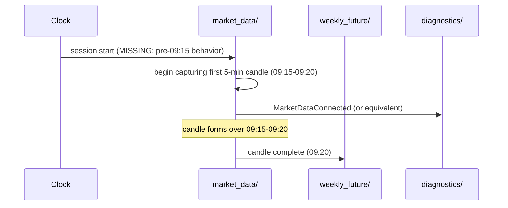
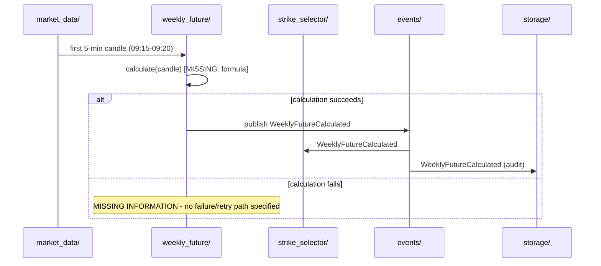
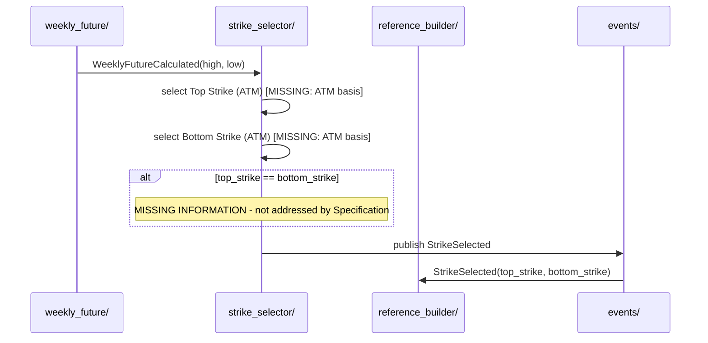
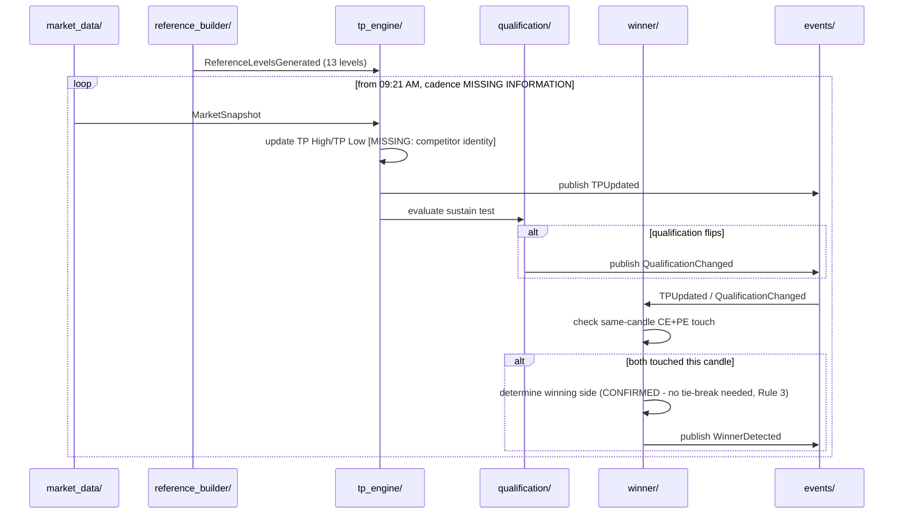
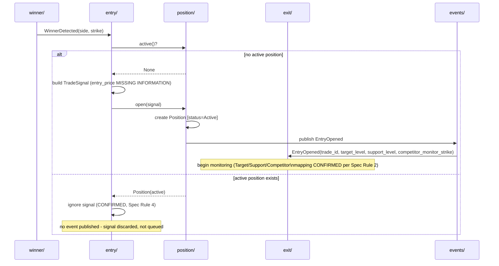
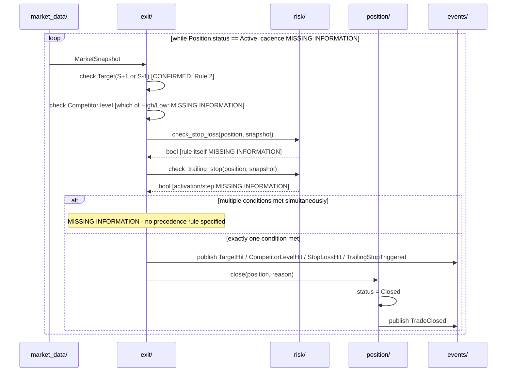
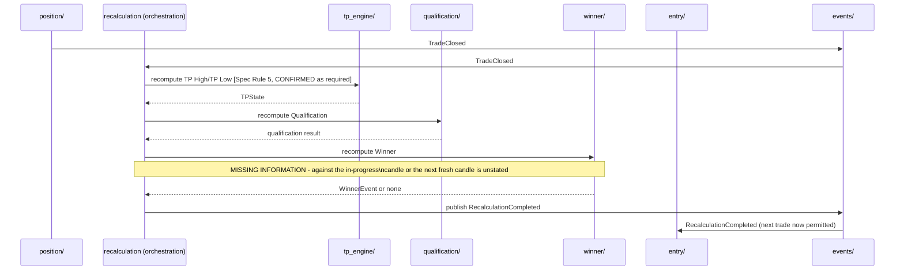
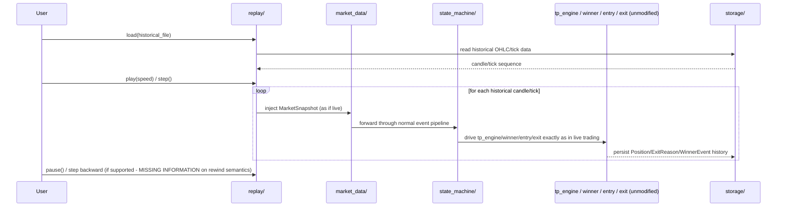
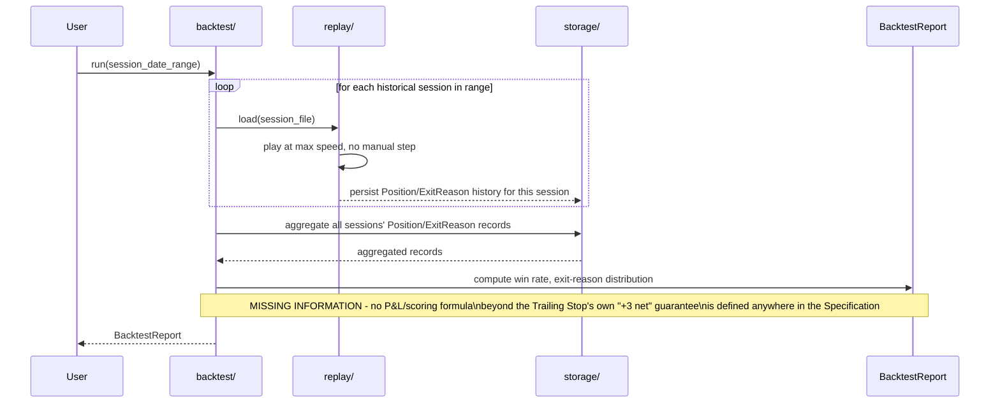

# Sequence Diagrams

Phase 2 (System Architecture) deliverable. Mermaid sequence diagrams
for the 9 required scenarios, built from `EVENT_CATALOG.md` and
`MODULE_ARCHITECTURE.md`. No business rule is invented; every
**MISSING INFORMATION** marker below carries forward a gap already
recorded in `research/specification/STRATEGY_FUNCTIONAL_SPECIFICATION.md`
v1.1.

---

## 1. Market Open

---

## 2. Weekly Future Calculation

---

## 3. Strike Selection

---

## 4. Winner Detection

---

## 5. Trade Entry

---

## 6. Trade Exit

---

## 7. Recalculation

---

## 8. Replay Engine

---

## 9. Backtest Engine

---

## 10. Cross-Cutting Notes

- Every diagram above reuses the **same** `tp_engine/`, `winner/`, `entry/`, `exit/`, `position/`, `risk/` modules — Replay and Backtest are data-source/orchestration wrappers, not parallel strategy implementations, per `MODULE_ARCHITECTURE.md` Section 3.15–3.16's forbidden-dependency rules.
- Every `MISSING INFORMATION` note in these diagrams is a direct carry-forward from `STRATEGY_FUNCTIONAL_SPECIFICATION.md` Section 20 — no new gap is introduced here, and none is resolved.
