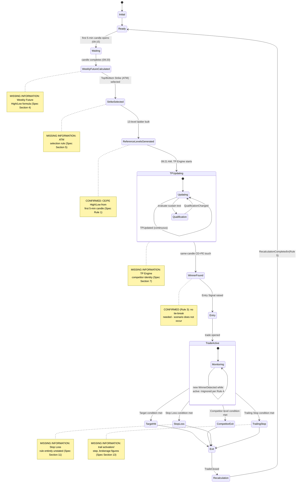
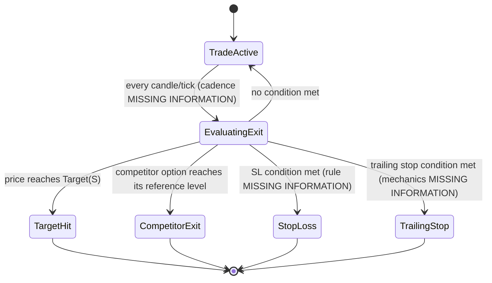

# State Machine

Phase 2 (System Architecture) deliverable. Derived strictly from
`research/specification/STRATEGY_FUNCTIONAL_SPECIFICATION.md` v1.1
("the Specification"). This document adds no business rule — every
state's *trigger* and *transition condition* cites the Specification
section it comes from, and every place the Specification does not
say enough to fully define a transition is marked **MISSING
INFORMATION**, carried forward unresolved, exactly as it appears
there.

---

## 1. State List

| # | State | Specification source |
|---|---|---|
| 1 | Initial | — (architectural bookkeeping state, not named in the Specification) |
| 2 | Ready | Section 3 (session start / post-recalculation) |
| 3 | Waiting | Section 3 ("Wait until the first candle completes") |
| 4 | WeeklyFutureCalculated | Section 4 |
| 5 | StrikeSelected | Section 5 |
| 6 | ReferenceLevelsGenerated | Section 6 (inserted between StrikeSelected and TPUpdating — see note below) |
| 7 | TPUpdating | Section 7 |
| 8 | Qualification | Section 7/8 |
| 9 | WinnerFound | Section 9 |
| 10 | Entry | Section 10 |
| 11 | TradeActive | Section 10/11 |
| 12 | TargetHit | Section 11 |
| 13 | CompetitorExit | Section 11 |
| 14 | StopLoss | Section 11 (rule itself MISSING INFORMATION) |
| 15 | TrailingStop | Section 13 |
| 16 | Exit | Section 11 |
| 17 | Recalculation | Section 3, Section 16 (Rule 5) |
| 18 | Ready (return) | Section 3, Rule 5 — same state as #2, re-entered |

**Note on `ReferenceLevelsGenerated`:** the user's document outline for this file did not list it as a named state, but Section 6 of the Specification places reference-level generation as its own step between Strike Selection and the TP Engine starting, and Section 15's own state diagram in the Specification includes a `LadderGenerated` state. It is included here for consistency with the Specification's own state diagram — flagged, not invented, since it is directly evidenced by Section 6/15 of the Specification rather than assumed.

---

## 2. Per-State Specification

### 2.1 Initial

- **Purpose:** Architectural bootstrap state before any session-specific processing begins. Exists for engineering completeness (every state machine needs a defined start); the Specification does not describe pre-session behavior.
- **Entry Conditions:** Process/engine startup.
- **Exit Conditions:** Immediate, unconditional transition to `Ready`.
- **Allowed Events:** None (transient state).
- **Next States:** `Ready`.
- **MISSING INFORMATION:** the Specification's Section 1 flags that "what happens between session start and 09:20 AM" is unstated — this state and its immediate transition to `Ready` is the architecture's placeholder for that gap, not a resolution of it.

### 2.2 Ready

- **Purpose:** The engine is idle, holding no Weekly Future/Strike/Ladder/TP state for the current session, ready to begin (or resume, post-recalculation) evaluation.
- **Entry Conditions:** From `Initial` (session start), or from `Recalculation` (post-exit, Rule 5: "allow the next trade").
- **Exit Conditions:** First 5-minute candle (09:15–09:20, Specification Rule 1) begins forming.
- **Allowed Events:** None that mutate state (a pure wait state).
- **Next States:** `Waiting`.
- **MISSING INFORMATION:** whether `Ready` (post-recalculation) reuses the *same* Weekly Future/Strikes/Ladder from earlier in the day, or triggers the whole Section 3 lifecycle again from `Waiting` — Specification Section 20 item 16 ("Whether Weekly Future/Strike Selection/Ladder Generation recur intraday or only once per day") is unresolved. This diagram shows the re-entry path returning to `Ready`→`Waiting` as the conservative default reading of Section 3's own lifecycle diagram, not a resolution of that gap.

### 2.3 Waiting

- **Purpose:** The first 5-minute candle (09:15–09:20) is forming; no calculation has started yet.
- **Entry Conditions:** From `Ready`, at candle-open (09:15, per Specification Rule 1).
- **Exit Conditions:** First 5-minute candle completes (09:20, Specification Section 4).
- **Allowed Events:** None (a pure wait state; the candle itself is external market data, not an internally-raised event in this state).
- **Next States:** `WeeklyFutureCalculated`.
- **MISSING INFORMATION:** exact end-of-candle detection mechanism (candle-close event source) is an architectural/market-data concern, not specified by the Specification.

### 2.4 WeeklyFutureCalculated

- **Purpose:** Weekly Future High and Weekly Future Low have been computed for the session.
- **Entry Conditions:** First 5-minute candle completed (09:20).
- **Exit Conditions:** Weekly Future High/Low values are available (computation succeeds).
- **Allowed Events:** `WeeklyFutureCalculated` (published on entry — see `EVENT_CATALOG.md`).
- **Next States:** `StrikeSelected`.
- **MISSING INFORMATION:** the Weekly Future High/Low **formula** itself (Specification Section 4, Section 20 item 1 — Critical). This state's entry condition ("computation succeeds") cannot be implemented until the formula is supplied. No failure/retry transition is modeled because the Specification does not describe one.

### 2.5 StrikeSelected

- **Purpose:** Top Strike and Bottom Strike (both "ATM") have been selected for the session.
- **Entry Conditions:** `WeeklyFutureCalculated` complete.
- **Exit Conditions:** Top Strike and Bottom Strike values are available.
- **Allowed Events:** `StrikeSelected`.
- **Next States:** `ReferenceLevelsGenerated`.
- **MISSING INFORMATION:** the ATM strike-selection rule itself (Specification Section 5, Section 20 item 2 — Critical): what "ATM" is computed against, strike-rounding rule, whether Top Strike and Bottom Strike can be equal.

### 2.6 ReferenceLevelsGenerated

- **Purpose:** The 13-level ladder (6 ITM, 1 ATM, 6 OTM) is built, each level carrying CE High/Low and PE High/Low taken from the first 5-minute candle (Specification Rule 1, **CONFIRMED**).
- **Entry Conditions:** `StrikeSelected` complete.
- **Exit Conditions:** All 13 levels' CE High/Low, PE High/Low values are populated.
- **Allowed Events:** `ReferenceLevelsGenerated`.
- **Next States:** `TPUpdating`.
- **MISSING INFORMATION:** ladder step size beyond the one 50-point example (Section 20 item 14); ladder center — one shared ladder or separate per Top/Bottom Strike (Section 6); whether these values are held fixed for the rest of the session or ever recalculated (Section 20 item 17).

### 2.7 TPUpdating

- **Purpose:** From 09:21 AM, the TP Engine continuously updates TP High (for Top Strike) and TP Low (for Bottom Strike) — Specification Section 7.
- **Entry Conditions:** `ReferenceLevelsGenerated` complete, and clock ≥ 09:21 AM.
- **Exit Conditions:** Continuous — this state does not "complete" in the way earlier states do; it runs concurrently with `Qualification` and remains active until a `WinnerFound` transition or session end.
- **Allowed Events:** `TPUpdated` (each update cycle).
- **Next States:** `Qualification` (concurrent/derived), `WinnerFound` (on Winner detection — see Section 2.9).
- **MISSING INFORMATION:** update cadence — tick or candle (Section 20 item 12, High); competitor-strike identity for the TP High/TP Low qualification test (Section 20 item 3, Critical — explicitly **not** the same as the now-confirmed Exit Engine competitor mapping, see Specification Section 7's note); whether "TP" is a price, a boolean flag, or both (Section 20 item 13).

### 2.8 Qualification

- **Purpose:** Represents the current sustained/qualified state of TP High and TP Low against their competitor levels — "current market state, not a prediction" (Specification Section 7).
- **Entry Conditions:** Concurrent with `TPUpdating`; re-evaluated on every TP update.
- **Exit Conditions:** N/A — a continuously-recomputed sub-state of `TPUpdating`, not a one-way transition.
- **Allowed Events:** `QualificationChanged` (on any qualified/unqualified flip).
- **Next States:** Returns to `TPUpdating` (self-loop); feeds `WinnerFound` detection.
- **MISSING INFORMATION:** the Specification itself does not clearly separate "TP Engine" and "Qualification Engine" into two distinct rule sets (Specification Section 8's own note); this state is modeled as a sub-state of `TPUpdating` for that reason, not as an independent state with its own entry/exit. External invalidation (news/budget/war/disaster, Section 7) has no detection mechanism specified.

### 2.9 WinnerFound

- **Purpose:** A CE and a PE (of the relevant strike(s)) have both touched their own reference levels within the same candle — Specification Section 9.
- **Entry Conditions:** During `TPUpdating`/`Qualification`, same-candle CE+PE touch detected.
- **Exit Conditions:** Winner side (CE or PE) and winning strike are determined.
- **Allowed Events:** `WinnerDetected`.
- **Next States:** `Entry`.
- **MISSING INFORMATION:** which strike(s)' CE/PE are being evaluated for "touch" — Top Strike's CE/PE specifically, or every strike's CE/PE (Specification Section 9's own "Trigger condition" row). **Resolved by the Specification (v1.1, Rule 3):** no tie-break logic is needed — the both-sides-touch-in-a-way-that-would-require-one scenario does not occur, so this state has exactly one deterministic winner whenever it is entered.

### 2.10 Entry

- **Purpose:** Immediately after `WinnerFound`, an Entry Signal is raised and a trade is opened, if no trade is currently active — Specification Section 10.
- **Entry Conditions:** `WinnerFound` complete.
- **Exit Conditions:** Trade opened (entry strike = winning strike, entry side = winning side, per Specification Rule 2's `Entry = S` mapping).
- **Allowed Events:** `EntryOpened`.
- **Next States:** `TradeActive`.
- **MISSING INFORMATION:** entry price/order type (market at signal candle close? limit at reference level?) — not stated anywhere in the Specification.
- **Confirmed guard (v1.1, Rule 4):** if a trade is already active, this transition does not fire at all — the Winner/Entry Signal is ignored outright, not queued. See `TradeActive`'s self-loop below.

### 2.11 TradeActive

- **Purpose:** Exactly one trade is open, being monitored against Target, Competitor Exit, Stop Loss, and Trailing Stop conditions — Specification Section 11.
- **Entry Conditions:** `Entry` complete.
- **Exit Conditions:** Any one of: Target Hit, Competitor Strike Reference Level Hit, Stop Loss, Trailing Stop (Specification Section 11, "OR").
- **Allowed Events:** none new (state monitors for the four sub-events below); also self-loops on any new `WinnerDetected` while active, per Rule 4 (ignored, no event side effect beyond the ignore itself — see `EVENT_CATALOG.md`'s `EntryOpened` entry).
- **Next States:** `TargetHit`, `CompetitorExit`, `StopLoss`, `TrailingStop` (mutually exclusive — whichever condition is met first).
- **MISSING INFORMATION:** exit-condition precedence if multiple conditions are met within the same candle (Specification Section 20 item 11, High) — this diagram models the four as mutually exclusive parallel-outgoing transitions, but does not (and per the Specification, cannot) resolve which one wins a simultaneous trigger.

### 2.12 TargetHit

- **Purpose:** The trade's Target reference level (Specification Rule 2: `CE(S+1)` for Winner CE, `PE(S-1)` for Winner PE) has been reached.
- **Entry Conditions:** From `TradeActive`, Target condition met.
- **Exit Conditions:** Immediate.
- **Allowed Events:** `TargetHit`.
- **Next States:** `Exit`.

### 2.13 CompetitorExit

- **Purpose:** The competitor strike's option (Specification Rule 2: `PE(S-1)` for Winner CE, `CE(S+1)` for Winner PE) has reached its own reference level.
- **Entry Conditions:** From `TradeActive`, competitor-level condition met.
- **Exit Conditions:** Immediate.
- **Allowed Events:** `CompetitorLevelHit`.
- **Next States:** `Exit`.
- **MISSING INFORMATION:** which of the competitor's own two reference levels (High or Low) is the trigger (Specification Section 20 item 8, High) — the competitor *strike/side* is confirmed, not which of its levels.

### 2.14 StopLoss

- **Purpose:** A Stop Loss condition has been reached.
- **Entry Conditions:** From `TradeActive`, Stop Loss condition met.
- **Exit Conditions:** Immediate.
- **Allowed Events:** `StopLossHit`.
- **Next States:** `Exit`.
- **MISSING INFORMATION:** the entire Stop Loss rule (Specification Section 11, Section 20 item 4 — Critical): SL price, SL basis, SL placement. This state cannot be implemented until that rule is supplied.

### 2.15 TrailingStop

- **Purpose:** A Trailing Stop condition has been reached, guaranteeing a minimum net +3 premium points after brokerage/exchange charges/tax (Specification Section 13).
- **Entry Conditions:** From `TradeActive`, Trailing Stop condition met.
- **Exit Conditions:** Immediate.
- **Allowed Events:** `TrailingStopTriggered`.
- **Next States:** `Exit`.
- **MISSING INFORMATION:** trail activation trigger, trail step/distance, and the brokerage/exchange/tax figures needed to compute "+3 net" (Specification Section 13, Section 20 items 9–10 — High).

### 2.16 Exit

- **Purpose:** The trade is closed, with an exit reason recorded (Target Hit / Competitor Level Hit / Stop Loss / Trailing Stop).
- **Entry Conditions:** From any of `TargetHit`, `CompetitorExit`, `StopLoss`, `TrailingStop`.
- **Exit Conditions:** Trade fully closed, exit reason recorded.
- **Allowed Events:** `TradeClosed`.
- **Next States:** `Recalculation`.

### 2.17 Recalculation

- **Purpose:** Per Specification Rule 5 ("After exit: Recalculate TP, Recalculate Qualification, Recalculate Winner, Allow the next trade"), TP/Qualification/Winner are recomputed before another trade can be entered.
- **Entry Conditions:** `Exit` complete.
- **Exit Conditions:** TP, Qualification, and Winner have all been recomputed.
- **Allowed Events:** `RecalculationCompleted`.
- **Next States:** `Ready` (re-entering the cycle — see Section 2.2's own open question about whether this reuses existing Weekly Future/Strikes/Ladder).
- **MISSING INFORMATION:** whether "recalculate Winner" here means immediately re-running the same-candle touch test against the *current* candle (which may already be in progress) or waiting for the next fresh candle — not stated.

---

## 3. Mermaid State Diagram — Full Lifecycle

---

## 4. Mermaid State Diagram — Trade Sub-Machine (Exit Conditions Detail)

**MISSING INFORMATION (summary for this sub-machine):** exit-condition evaluation cadence; precedence when multiple conditions fire in the same evaluation cycle; Stop Loss rule; Trailing Stop mechanics.

---

## 5. Open Questions Carried Into Later Phases

This document resolves no Specification gap. The following items from `STRATEGY_FUNCTIONAL_SPECIFICATION.md` Section 20 directly constrain state-machine implementation and must be resolved before Phase 6 (TP Engine) through Phase 10 (Exit) of `IMPLEMENTATION_ROADMAP.md` can begin:

- Critical: Weekly Future formula, ATM strike-selection rule, TP Engine competitor identity, Stop Loss rule, Defeat operational effect.
- High: candle timeframe for Winner/TP evaluation, competitor's triggering level (High/Low), trailing stop mechanics, brokerage/tax figures, exit-condition precedence, TP/Qualification update cadence.
