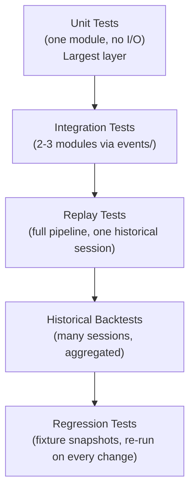

# Test Strategy

Phase 2 (System Architecture) deliverable. Testing approach for the
modules in `MODULE_ARCHITECTURE.md`, matching this repository's
already-established testing conventions (pytest, dependency-injected
clocks/sinks/transports, no real I/O in unit tests, `fail_under = 100`
coverage gate, `mypy --strict`). No business rule is invented; test
scenarios for **MISSING INFORMATION** items are listed as **cannot be
written yet**, not skipped silently.

---

## 1. Test Categories

| Category | Purpose | Example scope |
|---|---|---|
| Unit Tests | One module/class, in isolation, no I/O | `WinnerEngine.evaluate()` given a fixed `MarketSnapshot` |
| Integration Tests | Two or more modules wired together via `events/` | `reference_builder/` → `tp_engine/` → `winner/` end-to-end for one session |
| Replay Tests | Full pipeline driven by `replay/` against a historical file | A known historical day reproduces a known `WinnerEvent`/`Position` sequence |
| Historical Backtests | `backtest/` across many sessions | Aggregate win/loss/exit-reason counts over N sessions match expected |
| Regression Tests | Re-run a previously-passing replay/backtest fixture after any code change | Detects behavior drift in TP/Winner/Exit logic |
| Performance Tests | Throughput/latency of `tp_engine/`'s continuous update loop | Update cycle completes within a target latency budget (target **MISSING INFORMATION** — no SLA is specified anywhere) |
| Failure Recovery Tests | Module behavior when a dependency fails | `market_data/` disconnects mid-session — recovery behavior is largely **MISSING INFORMATION** (see `EVENT_CATALOG.md` Section 5) |
| Market Gap Tests | A candle/tick gap in the data feed | Reference-level generation with an incomplete first-5-minute candle — behavior **MISSING INFORMATION** |
| News Event Tests | Qualification invalidated by "News/Budget/War/Natural Disaster" (Specification Section 7) | No detection mechanism exists — cannot be tested until one is defined |
| Invalid Data Tests | Malformed/out-of-range market data | `MarketSnapshot` validation (high ≥ low, positive prices) — testable today, mirrors `ContractSnapshot`'s existing validation test pattern |

---

## 2. Per-Module Test Plan

### 2.1 `market_data/`

- **Expected Tests:** first-5-minute-candle capture correctness; OHLC validation (high ≥ low, positive prices — mirrors `trading_engine.market_data.market_tick.MarketTick`'s existing test pattern); tick/candle stream ordering.
- **Mock Requirements:** fake broker transport (mirrors `FakeRestTransport`/`FakeWebSocketTransport` from `trading_engine/tests/market_data/conftest.py`), injected clock.
- **Coverage Target:** 100%.
- **Cannot be written yet:** candle-vs-tick cadence tests (Specification Section 20 item 7).

### 2.2 `weekly_future/`

- **Expected Tests:** **Cannot be written yet** — no formula exists to test against (Specification Section 20 item 1, Critical). Interim: interface-conformance test against a stub implementation only.
- **Mock Requirements:** N/A until formula exists.
- **Coverage Target:** N/A until formula exists; interface stub itself should be 100%.

### 2.3 `strike_selector/`

- **Expected Tests:** **Cannot be written yet** — no ATM rule exists (Specification Section 20 item 2, Critical). Interim: interface-conformance test against a stub.
- **Mock Requirements:** N/A.
- **Coverage Target:** N/A until rule exists.

### 2.4 `reference_builder/`

- **Expected Tests:** 13-level ladder construction from a known strike pair and known per-strike candles; CE/PE High/Low correctly sourced from the first 5-minute candle (Rule 1, CONFIRMED — fully testable today); OHLC validation per level.
- **Mock Requirements:** Injected `StrikeSelection` (can be a literal test fixture, independent of Phase 4's blocked status), injected per-strike candle data.
- **Coverage Target:** 100%.
- **Cannot be written yet:** ladder step-size tests beyond the one 50-point example (Section 20 item 14); recalculation-vs-fixed tests (item 17).

### 2.5 `tp_engine/`

- **Expected Tests:** **Cannot be written yet** for the qualification test itself — competitor identity is Critical Missing Information (Section 20 item 3). Interim: interface-conformance test against a stub.
- **Mock Requirements:** N/A until competitor identity exists.
- **Coverage Target:** N/A.

### 2.6 `qualification/`

- **Expected Tests:** **Cannot be written yet** — depends entirely on `tp_engine/` (Section 2.5).
- **Mock Requirements:** N/A.
- **Coverage Target:** N/A.

### 2.7 `winner/`

- **Expected Tests:** same-candle CE+PE touch detection (positive and negative cases); confirmation that no tie-break code path exists or is reachable (Rule 3, CONFIRMED — this should be tested as an explicit "asserted absent" case, e.g. constructing a scenario that *would* need a tie-break and asserting the module either does not reach that state or documents it as impossible, mirroring this repository's "deliberate, spec-faithful gap" testing convention used in `trading_engine/market_data/`'s `unsubscribe()` no-event case).
- **Mock Requirements:** Injected `MarketSnapshot` sequence, injected `ReferenceLevel` ladder, injected `TPState` (stubbed if Phase 6/7 are still blocked).
- **Coverage Target:** 100% for the touch-detection logic that does not depend on the blocked competitor-identity question.
- **Cannot be written yet:** tests depending on which strike(s)' CE/PE are in scope (Section 9's own open question).

### 2.8 `entry/` and `position/`

- **Expected Tests:** entry immediately after `WinnerDetected` (happy path); single-active-trade enforcement — a second `WinnerDetected` while active produces no new `Position` and no `EntryOpened` event (Rule 4, CONFIRMED); Target/Support/Competitor-monitor-strike fields correctly computed per the S±1 mapping (Rule 2, CONFIRMED) for both Winner CE and Winner PE.
- **Mock Requirements:** Injected `WinnerEvent` fixtures (both sides, several strikes including ladder edges); injected `PositionManager` state.
- **Coverage Target:** 100% — this module is fully unblocked and should have complete coverage from the start.
- **Cannot be written yet:** entry-price/order-type tests (not stated).

### 2.9 `exit/` and `risk/`

- **Expected Tests (unblocked portion):** Target-hit detection (`CE(S+1)`/`PE(S-1)`, CONFIRMED); Competitor-level detection for the confirmed competitor strike/side (which of its High/Low triggers remains open, so only the strike/side identification is testable, not the full trigger).
- **Expected Tests (blocked portion):** **Cannot be written yet** — Stop Loss (Section 20 item 4, Critical), Trailing Stop mechanics and brokerage/tax figures (items 9–10).
- **Mock Requirements:** Injected `Position` fixtures at various strikes/sides; injected `MarketSnapshot` sequences approaching Target/Competitor levels.
- **Coverage Target:** 100% for Target/Competitor-strike-identification logic; N/A for Stop Loss/Trailing Stop until rules exist.
- **Exit-precedence tests:** **cannot be written yet** — no precedence rule exists (Section 20 item 11); once multiple conditions are simultaneously testable, a dedicated precedence test suite should be added.

### 2.10 `defeat/`

- **Expected Tests:** trigger detection only (a strike crossing a reference level) — testable today as a pure detection function.
- **Mock Requirements:** Injected `MarketSnapshot`, `ReferenceLevel` ladder.
- **Coverage Target:** 100% for detection; **cannot be written yet** for any consumer/effect test, since none exists (Section 20 item 5, Critical).

### 2.11 `events/`

- **Expected Tests:** every event dataclass's structural validation (mirrors `trading_engine/tests/diagnostics/test_*_events.py`'s existing per-event test-class pattern); publish/subscribe bus round-trip.
- **Mock Requirements:** None — pure value objects and an in-memory bus.
- **Coverage Target:** 100%.

### 2.12 `state_machine/`

- **Expected Tests:** every transition in `STATE_MACHINE.md`'s Mermaid diagram, both allowed and (as negative tests) disallowed transitions; the `Ready` re-entry ambiguity (Section 20 item 16) should be tested against whichever interim engineering default is chosen, with the test explicitly labeled as testing an *assumption*, not a confirmed rule.
- **Mock Requirements:** Injected event stream fixtures.
- **Coverage Target:** 100%.

### 2.13 `replay/`

- **Expected Tests:** load/step/play/pause mechanics against a small fixture historical file; event-stream shape parity with a live-driven run (same event types/order for the same input data).
- **Mock Requirements:** Fixture CSV/SQLite historical data (mirrors `trading_engine/replay/history_loader.py`'s existing `HistoryLoader` test fixtures).
- **Coverage Target:** 100%.

### 2.14 `backtest/`

- **Expected Tests:** multi-session orchestration (N sessions run, N `Position` histories aggregated); report generation for the confirmed metrics (win/loss count, exit-reason distribution).
- **Mock Requirements:** Multiple fixture historical files.
- **Coverage Target:** 100% for orchestration logic; **cannot be written yet** for any P&L-style metric beyond what's confirmed (no scoring formula exists).

### 2.15 `live/`

- **Expected Tests:** connection lifecycle against a fake broker transport (mirrors `trading_engine/tests/market_data/test_upstox_provider.py`'s existing pattern); event-stream shape parity with replay.
- **Mock Requirements:** Fake broker transport, no real network.
- **Coverage Target:** 100% for connectivity/orchestration; **cannot be written yet** for real order placement (entirely unstated).

### 2.16 `storage/`

- **Expected Tests:** save/load round-trip for every entity type, across every backend (InMemory/CSV/SQLite — mirrors `trading_engine/premium_snapshot/`'s existing parametrised-repository test pattern); failure-path tests (`OSError`/`sqlite3.Error` injection via `monkeypatch`, matching that same milestone's established convention).
- **Mock Requirements:** `tmp_path` fixture, injected failures.
- **Coverage Target:** 100%.

### 2.17 `diagnostics/`

- **Expected Tests:** every module's diagnostic events emit correctly on the relevant lifecycle transitions (mirrors this repository's existing per-milestone diagnostics test files, e.g. `test_market_data_events.py`, `test_premium_snapshot_events.py`).
- **Mock Requirements:** `InMemoryDiagnosticsSink` (reuse recommended).
- **Coverage Target:** 100%.

---

## 3. Test Pyramid

---

## 4. Failure/Recovery, Gap, and News-Event Test Scope

These three categories are, almost in their entirety, **MISSING
INFORMATION**:

- **Failure Recovery Tests:** every event in `EVENT_CATALOG.md` has an unresolved "Recovery Behaviour" field except `EntryOpened`'s confirmed ignore-while-active rule. Only that one recovery path is currently testable.
- **Market Gap Tests:** no rule describes engine behavior for missing/incomplete candle data (this repository's *unrelated* `trading_engine.replay.history_loader.HistoryLoader.detect_missing_candles()` exists for a different milestone's data-quality reporting, and is not assumed to define this strategy's gap-handling behavior).
- **News Event Tests:** Specification Section 7 names the scenario (news/budget/war/disaster invalidating qualification) but gives no detection mechanism — untestable until one exists.

These should remain on the roadmap as explicitly tracked gaps (per
`IMPLEMENTATION_ROADMAP.md` Phase 14's acceptance criteria), not
silently dropped from the test plan.

---

## 5. Coverage and Quality Gates

Matching this repository's established convention across every prior
milestone:

| Gate | Target |
|---|---|
| `pytest` | All tests passing, 0 regressions |
| Coverage | 100% (`fail_under = 100`), per unblocked module |
| `mypy --strict` | Clean |
| `ruff check` | Clean |
| `black --check` | Clean |

Blocked modules (Section 2.2, 2.3, 2.5, 2.6, and part of 2.9) are
explicitly exempted from the 100% target until their business rules
are resolved — their *interface/stub* code should still meet 100%
coverage on its own, narrow scope.
