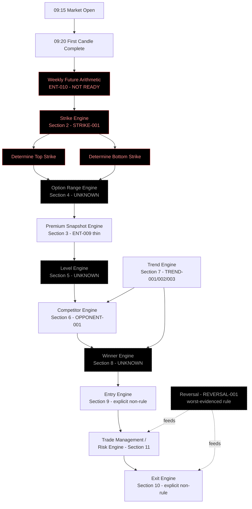

# Realtime Trading Specification (Milestone K2)

Evidence-first Functional Specification Document. Every claim below is
traceable to (a) a document under `docs/` or `research/`, (b)
`research/transcripts/TR-001.md` directly, or (c) the user-supplied
workflow given for this milestone (structural sequence and the 15
engine/component names only - never their internal mathematics). Where
a component's actual rule, threshold, formula, or decision logic is
not evidenced by (a) or (b), the item is marked **UNKNOWN** rather than
filled with a plausible guess. This document does not soften any NOT
READY verdict already established in the repository - almost the
entire engine's actual mathematics remains unevidenced, per
`research/analysis/FOUNDATIONAL_KNOWLEDGE_MAP.md` Section 4 and
`research/analysis/WEEKLY_FUTURE_VERIFICATION.md` (Phase E1).

No code or pseudocode appears anywhere in this document. The two
Mermaid diagrams (Sections 1 and 15) are diagramming syntax describing
structure/sequence, not executable trading logic.

---

## 1. Overall Workflow

Source: user-supplied workflow for Milestone K2 (this prompt). This
sequence is used verbatim, in order, with no steps added or removed.
It is a **structural skeleton only** - the presence and order of these
ten steps is asserted by the user for this milestone; almost nothing
about *what happens inside* each step is evidenced by the repository.

| # | Step | Evidence backing the step's existence | Evidence backing the step's internal logic |
|---|---|---|---|
| 1 | 09:15 Market Open | User-supplied workflow only. TR-001 discusses "9:15" as a session-start reference point (research/transcripts/TR-001.md line 1850, "9:15 பிஃபோர்... 9:15க்கு பிபோரும்"). | N/A - a clock event, not a calculation. |
| 2 | 09:20 First candle complete | User-supplied workflow asserts "09:20" specifically. `docs/RULE_INDEX.md` STRIKE-001 and `docs/STATE_MACHINE.md` (`STRIKE_SELECTED`) reference "the first candle" as a concept, but neither document evidences the exact candle duration or a 09:20 completion time - that specific minute is UNKNOWN against repository evidence and comes only from the user-supplied workflow. |
| 3 | Determine Top Strike | `research/analysis/STRIKE_EVIDENCE_TABLE.md`, `STRIKE_EVIDENCE_SUMMARY.md`, `docs/RULE_INDEX.md` STRIKE-001. Top Strike = Weekly Future first-candle High, rounded to nearest exchange-listed strike (see Section 2). | Rule shape evidenced (PARTIALLY READY); underlying Weekly Future arithmetic is NOT READY (see Section 2/17). |
| 4 | Determine Bottom Strike | Same as above; Bottom Strike = Weekly Future first-candle Low, rounded to nearest exchange-listed strike. | Same NOT READY status - depends on the same broken Weekly Future arithmetic. |
| 5 | Capture Premium Levels | `docs/architecture/DOMAIN_ARCHITECTURE.md` lines 179-190 (Premium, ENT-009, "Confirmed (thin)"). | Only a minimal value holder is evidenced (id/value/timestamp); no CE/PE-specific structure or "capture" formula is evidenced (see Section 3). |
| 6 | Monitor Competitor | `docs/RULE_INDEX.md` OPPONENT-001, `docs/architecture/DOMAIN_ARCHITECTURE.md` lines 92-119 ("Opponent"). Terminology note: the architecture explicitly does **not** assume "Opponent" = "competitor" (see Section 6). | "Defeat" condition Unknown; Opponent High/Low (OPPONENT-002/003) Awaiting Evidence, Evidence Count 0. |
| 7 | Determine Winner | No repository rule ID or entity corresponds to a "Winner" concept. This step's existence comes only from the user-supplied workflow. | Entirely UNKNOWN (see Section 8). |
| 8 | Entry | `docs/TRADINGVIEW_STRATEGY_BIBLE.md` ENTRY category is empty (line 258-260). `research/transcripts/TR-001.md` lines ~1780-2440, 3228, 3981 discuss entry discipline in prose (see Section 9). | No fixed formula; explicit non-rule evidenced ("logical entry," "don't chase"). |
| 9 | Trade Management | No dedicated Bible category; TR-001 discusses risk/stop-loss extensively (see Sections 10-11). | No fixed rule; explicit non-rule evidenced (subjective risk factor). |
| 10 | Exit | `docs/TRADINGVIEW_STRATEGY_BIBLE.md` EXIT category is empty (line 262-264). TR-001 discusses stop-loss acceptance in prose (see Section 10). | No fixed formula; explicit non-rule evidenced. |

### Architecture diagram (15 engines/components + Overall Workflow)

Note on the diagram: dashed/gray nodes are UNKNOWN in mathematics; the
Weekly Future / Strike chain is flagged NOT READY per
`research/analysis/WEEKLY_FUTURE_VERIFICATION.md`. Dependency arrows
follow `docs/RULE_INDEX.md`'s "Depends On" columns and
`research/analysis/IMPLEMENTATION_UNLOCK_SEQUENCE.md`'s Task 6a
ranking; no arrow is drawn unless a "Depends On" relationship or an
explicit workflow-sequence step evidences it.

---

## 2. Strike Engine

**Purpose:** Determine Top Strike and Bottom Strike for the trading
session (workflow steps 3-4).

**Inputs:** Weekly Future synthetic instrument's first-candle High and
Low (`research/analysis/WEEKLY_FUTURE_EVIDENCE_TABLE.md` row WF-14),
which are themselves derived from Call option first-candle High/Low,
Put option first-candle High/Low, and the day's ATM strike
(`research/analysis/WEEKLY_FUTURE_VERIFICATION.md` "Input definitions"
row - Met: Yes).

**Outputs:** Top Strike, Bottom Strike - each an exchange-listed strike
price nearest to the Weekly Future first-candle High/Low respectively.

**Rule shape (evidenced in words, PARTIALLY READY):**
- Top Strike / Bottom Strike = Weekly Future first-candle High/Low,
  rounded to nearest exchange-listed strike
  (`research/analysis/STRIKE_EVIDENCE_TABLE.md`,
  `STRIKE_EVIDENCE_SUMMARY.md`).
- Which side is analyzed first is chosen by the first candle's
  bullish/bearish character (7 of 14 rows in
  `STRIKE_EVIDENCE_TABLE.md` show this reasoning explicitly), **except**
  when the first candle is a Doji, in which case both strikes are kept
  and the choice is deferred to the second candle's direction
  (`STRIKE_EVIDENCE_TABLE.md` row 13, quote: "there is no rule for
  where we start from").

**Dependencies:** Weekly Future arithmetic (ENT-010).

**Unknown mathematics:** The Weekly Future High/Low arithmetic itself
is NOT READY - `research/analysis/WEEKLY_FUTURE_VERIFICATION.md`
(Phase E1, most recent/authoritative, superseding the older PARTIALLY
READY verdict in `WEEKLY_FUTURE_DEPENDENCY_ANALYSIS.md`) documents that
the one worked example in TR-001 is self-contradictory: an addend
spoken as 91, self-corrected to 81, then used as 82; two different
final Low values (26,268 and 26,168) for the same candle; the
computed Low even exceeds the computed High for that candle - a
structural impossibility never flagged by the speaker. Zero of the
required three internally-consistent worked examples exist. The
"Complete Calculation Video for Weekly Future" that the speaker
references twice (TR-001 lines 816, 2467) as containing the missing
material has not been located despite multiple acquisition attempts
(Phase E1/E2). **Overall status: PARTIALLY READY for the rule shape,
NOT READY overall** because the arithmetic it depends on fails
Phase E1's acceptance criteria outright.

**Exact rounding rule (nearest-strike selection tie-break, strike
interval value):** UNKNOWN - not evidenced anywhere in
`STRIKE_EVIDENCE_TABLE.md` or `STRIKE_EVIDENCE_SUMMARY.md`.

---

## 3. Premium Snapshot Engine

**Purpose:** "Capture Premium Levels" (workflow step 5).

**Inputs:** UNKNOWN beyond "raw observation" - `docs/architecture/DOMAIN_ARCHITECTURE.md`
lines 179-190 describes Premium (ENT-009) as "Confirmed (thin)":
"Referenced only indirectly, as the basis for identifying a Reversal.
No rule defines Premium as a first-class concept yet (which contract,
CE/PE/both)."

**Outputs:** A Premium value holder - "id/value/timestamp" only, per
the deliberately thin domain model (`docs/architecture/DOMAIN_ARCHITECTURE.md`
lines 188-190: "Modeled as a minimal value holder only - deliberately
thin, since adding CE/PE-specific structure now would be inventing
attributes the evidence doesn't yet support.").

**Dependencies:** None evidenced.

**Unknown mathematics:** No formula for "capturing premium levels"
beyond raw observation is evidenced anywhere. Whether Premium
distinguishes CE vs PE, what "level" means beyond a raw value, and at
what cadence/candle a "level" is captured are all UNKNOWN.

---

## 4. Option Range Engine

**Purpose:** Container for the "6 ITM, ATM, 6 OTM" option range
referenced in the user-supplied workflow context for this milestone.

**Inputs/Outputs/selection mechanism:** UNKNOWN. This concept and the
specific "6/ATM/6" range come **only** from this milestone's
user-supplied framing, with **zero repository evidence** backing it.
A direct grep of `research/transcripts/TR-001.md` for "ITM" and "OTM"
(case-insensitive) returns zero matches - the terms do not appear
anywhere in the only saved transcript. No document under `docs/` or
`research/` defines an option-range concept, its width, its selection
mechanism, or its storage/mapping.

**Dependencies:** Presumably Strike Engine output (Top/Bottom Strike),
by workflow position - not confirmed by any repository document.

**Unknown mathematics:** Everything - range width, ITM/OTM boundary
definition, selection/refresh cadence, and mapping to instruments are
all UNKNOWN. Only the structural existence of "a container of option
strikes around ATM" is asserted, and only by the user-supplied
workflow for this milestone, not by repository evidence.

---

## 5. Level Engine

**Purpose:** Maintain whatever "levels" (per Section 3's captured
Premium levels, and any price levels used by Monitor Competitor/Trend
tracking) the workflow's "Capture Premium Levels" step produces and
downstream steps consume.

**Inputs:** Premium Snapshot Engine output (Section 3).

**Outputs:** UNKNOWN - no repository entity or rule ID corresponds to
a distinct "Level" object separate from Premium (ENT-009) and
TrendPoint (ENT-003). `docs/architecture/DOMAIN_ARCHITECTURE.md` does
not name a "Level Engine" or "Level" entity.

**Dependencies:** Premium Snapshot Engine (assumed by workflow
position only).

**Unknown mathematics:** UNKNOWN in full. This is a named component in
the milestone's 15-engine list but has no corresponding rule ID,
entity ID, or transcript evidence distinguishing it from Premium
(Section 3) or TrendPoint (Section 7). Its scope, if any beyond those
two evidenced concepts, is UNKNOWN.

---

## 6. Competitor Engine

**Purpose:** "Monitor Competitor" (workflow step 6). Maps to
OPPONENT-001 in `docs/RULE_INDEX.md`.

**Terminology flag (explicitly unresolved, not silently equated):**
Per `docs/architecture/DOMAIN_ARCHITECTURE.md` lines 104-112: "Whether
'Opponent' is the same concept as 'competitor' already implemented
elsewhere in this repository (`strategy/exit_signal.py`'s Competitor
Exit) is explicitly unconfirmed (`TERMINOLOGY.md`). **This architecture
does not assume they are the same** - the `domain` package's Opponent
object is designed as its own concept, not wired to or modeled after
the existing Python `strategy/` package's competitor logic... Proximity
of language is not evidence of conceptual equivalence." This
specification preserves that same flag: **UNKNOWN/unresolved** whether
"Competitor Engine" (this milestone's user-supplied name) is the same
thing as "Opponent" (OPPONENT-001/002/003).

**Inputs:** A Strike (from the Strike Engine); an Opponent entity with
a High and a Low (`docs/architecture/DOMAIN_ARCHITECTURE.md` lines
92-102, "Known attributes: Has a High and a Low... has a TrendPoint of
its own").

**Outputs:** A "defeated / not defeated" evaluation of the Opponent by
the current Strike (OPPONENT-001: "A strike progresses only after
defeating the next opponent").

**Rule shape:** Repeated references to "Next Opponent Defeat"
(`docs/RULE_INDEX.md` row 34, Evidence Count 2). Illustrated only via
specific worked examples in TR-001 (e.g. lines 1805-1817's 650-strike
walkthrough referencing "ஆப்போனன்ட்டோட ஹை" / Opponent's High at 149)
that were never generalized into a stated formula.

**Dependencies:** TREND-001 (Trend Engine), OPPONENT-002, OPPONENT-003.

**Unknown mathematics:** What precisely "defeating" means (touching
the opponent's TP Low? closing beyond it? by how much?) is not
evidenced with a precise rule (`docs/RULE_INDEX.md` Open Questions:
"Also unclear what mathematically constitutes 'defeating' the next
opponent."). Opponent High (OPPONENT-002) and Opponent Low
(OPPONENT-003) are both "Awaiting Evidence," Evidence Count 0 - TR-001
never defined these (`docs/RULE_INDEX.md` row 35/36 Notes; confirmed
in `docs/architecture/DOMAIN_ARCHITECTURE.md` lines 122-137: "Modeled
only as reserved attribute slots... with no defined computation.").

---

## 7. Trend Engine

**Purpose:** Maintain each analyzed Strike's Trend Point Low (TP Low)
and evaluate the Edge condition. Backs TREND-001/002/003.

**Inputs:** A Strike; ongoing price/candle data for that strike's
option contract (implied by "dynamically-updated," not itself
formula-evidenced).

**Outputs:** A TrendPoint value per analyzed strike (TREND-001); a
market-structure-change-triggered update to that value (TREND-002); an
Edge condition evaluated over the current strike's TrendPoint and its
Opponent's TrendPoint (TREND-003).

**Rule shape (as stated in words, no formula):**
- TREND-001: "Every analysed strike maintains a dynamically-updated
  Trend Point Low" (`docs/RULE_INDEX.md` row 31). Mathematical
  Definition: **Partially Known** - no formula connecting a Strike to
  its TP Low value is evidenced (`docs/TRADINGVIEW_STRATEGY_BIBLE.md`
  line 131).
- TREND-002: "TP Low is not static - converts to a new value when
  market structure changes" (`docs/RULE_INDEX.md` row 32). Depends on
  TREND-001. What constitutes "market structure change" is fully
  UNKNOWN - no definition anywhere
  (`docs/architecture/DOMAIN_ARCHITECTURE.md` lines 141-154: "what
  constitutes market structure' and 'what counts as a change to it'
  are both `Unknown`").
- TREND-003 (Edge): "Both current and opponent TP Lows staying well
  below the strike reduces probability of price moving below it"
  (`docs/RULE_INDEX.md` row 33). Depends on TREND-001 and OPPONENT-001.
  "Well below" is never quantified - no threshold evidenced. Edge is
  modeled as a condition over two TrendPoints, not a standalone entity
  (`docs/architecture/DOMAIN_ARCHITECTURE.md` lines 194-213).

**Dependencies:** None for TREND-001 itself; TREND-002 depends on
TREND-001; TREND-003 depends on TREND-001 and OPPONENT-001.

**Unknown mathematics:** The formula connecting a Strike's own data to
its TP Low value; the precise trigger condition for "market structure
change"; the quantified threshold for "well below." All three are
UNKNOWN per the citations above. Readiness: **NOT READY** for all
three rules (`research/analysis/KNOWLEDGE_READINESS_DASHBOARD.md`
TREND-001/002/003 rows).

---

## 8. Winner Engine

**Purpose:** "Determine Winner" (workflow step 7).

**Inputs/Outputs/confidence calculation:** **UNKNOWN in full.** No
rule ID, entity ID, or Bible category corresponds to a "Winner"
concept anywhere in `docs/RULE_INDEX.md`,
`docs/TRADINGVIEW_STRATEGY_BIBLE.md`, or
`docs/architecture/DOMAIN_ARCHITECTURE.md`. A targeted grep of
`research/transcripts/TR-001.md` for "confidence" /
"கான்பிடன்ஸ்" (case-insensitive) returned zero matches. No evidenced
confidence-scoring mechanism exists anywhere in the repository.

**Dependencies:** Presumably Competitor Engine (Section 6) and Trend
Engine (Section 7) outputs, by workflow position only - not confirmed
by any repository document.

**Unknown mathematics:** Everything - what "winning" means (a Strike
defeating its Opponent per OPPONENT-001, i.e. identical to Competitor
Engine's output? Or a distinct comparison?), how confidence would be
scored, and what output this engine produces are all UNKNOWN. This
milestone brief's suspicion is confirmed: no evidenced
confidence-scoring mechanism was found anywhere in the repository.

---

## 9. Entry Engine

**Purpose:** "Entry" (workflow step 8).

**Repository rule status:** `docs/TRADINGVIEW_STRATEGY_BIBLE.md`'s
ENTRY category (line 258-260) is **empty** - zero confirmed rules
exist.

**Evidence found directly in TR-001.md (explicit non-rule, stronger
than plain UNKNOWN):** Extensive prose discussion of entry discipline
exists at lines ~1780-2440 (and reiterated at lines 3228, 3981). The
speaker repeatedly states entry is a "logical" judgment, not an
indicator-based formula:

- "என்ட்ரியே சேஸ் பண்ணாதீங்க. லாஜிக்கலி புரிஞ்சுக்கோங்க. கான்செப்ட்ட
  புரிஞ்சுக்கங்க கான்செப்ட் படி என்ட்ரி எடுங்க." ("Don't chase entry.
  Understand it logically. Understand the concept, enter according to
  the concept.") - TR-001.md line 1862.
- "பணனக்கூடாதுன்றது ஒரே பதில்... சேஸ் பண்ண கூடாது" ("The one answer is:
  you must not [chase]... must not chase") - TR-001.md line 1784,
  explicitly framed as a "no" answer to "should I chase the price," not
  a formula for where to enter instead.
- Entry is gated on the trader's own tolerance for the position's risk
  factor before entry is taken: "இந்த ரிஸ்க் ஃபேக்டர் நம்மளால தாங்க
  முடியுமான்னு பாருங்க அது ஓகேனா என்ட்ரி எடுங்க" ("Check whether you
  can bear this risk factor - if that's OK, take the entry.") -
  TR-001.md line 1852-1853.
- A Trend Point being newly created ("டிபி கிரியேட் ஆகுது") in the
  chosen direction is described as the qualifying condition to act on
  (TR-001.md lines 1793, 1850), consistent with TREND-001/OPPONENT-001
  but without a numeric threshold.

**Inputs:** Chosen direction (call/put side), per the trader's own
prior direction choice (TR-001.md lines 1849-1850: direction can be
chosen before 9:15 or up to "10/15 minutes/half an hour" into the
session); a qualifying TrendPoint event in that direction.

**Outputs:** An entry decision (enter / do not enter).

**Dependencies:** Trend Engine (qualifying TrendPoint), Winner Engine
(direction), Risk Engine (risk-factor tolerance check).

**Unknown mathematics:** No fixed entry price rule, no fixed indicator,
no numeric trigger. This is a **documented absence of a formula** -
the speaker explicitly frames entry/stop-loss/target as "logical
things," not governed by a fixed indicator-based rule.

---

## 10. Exit Engine

**Purpose:** "Exit" (workflow step 10).

**Repository rule status:** `docs/TRADINGVIEW_STRATEGY_BIBLE.md`'s
EXIT category (line 262-264) is **empty** - zero confirmed rules
exist.

**Evidence found directly in TR-001.md (explicit non-rule):**

- "ஈவன் தோ நீங்க நல்ல என்ட்ரி எடுத்து நல்ல பிரைஸ் வச்சு சரியான ரிஸ்க்
  ஃபேக்டர்லாம் ஆனா கால்குலேட் பண்ணியும் கீழ வந்து உங்க ஸ்டாப் லாஸ்
  அடிக்குனா தயவு செஞ்சு அக்செப்ட் பண்ணிட்டு மூவ் ஆன் ஆயிடுங்க அது கூட
  போய் போட்டி போடாதீங்க" ("Even if you took a good entry, at a good
  price, calculated the right risk factor - if your stop-loss still
  hits, please accept it and move on. Don't fight it either.") -
  TR-001.md lines 1852-1853.
- Reversal (REVERSAL-001) is the only rule that touches exit-adjacent
  behavior in the Bible, and it is itself the worst-evidenced rule in
  the project (see Section 17) - "A reversal must be identified through
  premium behaviour, never assumed" - Mathematical Definition:
  **Unknown**, with no natural-language rule shape stated anywhere for
  what premium behavior constitutes a reversal
  (`research/analysis/FOUNDATIONAL_KNOWLEDGE_MAP.md`'s own
  characterization).

**Inputs:** Open position state; stop-loss/target reference points (see
Section 11); Reversal identification (REVERSAL-001), if evidenced.

**Outputs:** An exit decision.

**Dependencies:** Risk Engine (Section 11), Reversal (REVERSAL-001,
UNKNOWN).

**Unknown mathematics:** No fixed exit rule or target formula. As with
Entry, this is a documented absence of a formula, not a gap awaiting
discovery of a hidden one - the speaker's own words frame exit
decisions as "logical" and personally accepted, not computed.

---

## 11. Risk Engine

**Purpose:** Support "Trade Management" (workflow step 9) with
stop-loss / risk-factor handling.

**Evidence found directly in TR-001.md (explicit non-rule, quoted
directly):**

- "ஸ்டாப் லாஸ்க்கு வந்து யாருமே பிக்சடா யாரும் சொல்ல முடியாது" ("Nobody
  can fix a stop-loss for you") - paraphrase of the repeated framing
  across lines ~1780-2440; risk-factor sizing is stated to depend "on
  your character, capital, and emotions."
- Worked illustrative point counts given as the speaker's own practice,
  not a universal rule: "இந்த ரிஸ்க் ஃபேக்டர் என்ன? 22 பாயிண்ட்ஸ்
  மேக்சிமம் 25 பாயிண்ட்ஸ் அண்ட் 22 பாயிண்ட்ஸ் தான் நிஃப்டிக்கு எல்லாம்
  மரியாதை அதுக்கு மேல நீங்க ஸ்டாப் லாஸ் வச்சீங்கன்னா இட்ஸ் அப்டு
  உங்களுடைய ஓன் ரிஸ்க் தான்" ("What's the risk factor? 22 points,
  maximum 25 points - 22 points is the [maximum I give] respect for
  Nifty. Beyond that, if you place your stop-loss, it's up to your own
  risk.") - TR-001.md lines 1808-1811.
- A second, separate illustrative figure appears elsewhere in TR-001:
  "உங்களுக்கு ரிஸ்க் நீங்க ரிஸ்க் ஃபேக்டர் உடைய அளவு எவ்வளவுன்னு
  பாத்துக்கோங்க என்ன பொறுத்த வரைக்கும் மோர் தன் 10 டு 15 இஸ்" ("Check
  what your own risk-factor amount is - as far as [I'm] concerned, it's
  more than 10 to 15 [points]") - TR-001.md line 160. These two figures
  (22-25 vs. 10-20) are **not reconciled** with each other anywhere in
  the transcript and are presented as personal illustrations, not a
  fixed universal threshold.

**Inputs:** Entry price; Opponent High/Low (per the 650-strike example
at TR-001.md lines 1805-1817, where "Opponent High" at 149 is used as
an illustrative reference point for where a stop-loss zone might sit).

**Outputs:** A stop-loss / risk-acceptance decision.

**Dependencies:** Entry Engine, Competitor Engine (for the illustrative
Opponent-High reference point).

**Unknown mathematics:** There is **no fixed stop-loss formula**. This
is an explicit, repeatedly stated non-rule in TR-001, not merely an
unevidenced gap: risk sizing is stated to be a subjective, personal
decision "depending on your character, capital, and emotions," with
only illustrative (and mutually inconsistent) point-count examples
given.

---

## 12. Real-Time Data Requirements

**Purpose:** Identify what live market data the engines above would
need, based strictly on what those sections already established.

Per Sections 2-11, the following data classes are implied by evidenced
inputs:
- Weekly Future synthetic first-candle High/Low (Section 2) - itself
  computed from Call/Put option first-candle High/Low and ATM strike.
- Premium (Section 3) - a per-instrument value/timestamp stream.
- Opponent High/Low per strike (Section 6) - UNKNOWN computation, but
  the raw price data needed would be per-option-contract OHLC.
- TrendPoint per strike (Section 7) - UNKNOWN computation, same raw
  price data dependency.

**What is NOT evidenced:** Candle interval/timeframe (beyond "first
candle" and the workflow's asserted 09:20 completion, itself
user-supplied for this milestone, not repository-evidenced); tick vs.
candle-close granularity; data retention/replay requirements beyond
what `research/analysis/REPLAY_ENGINE_ARCHITECTURE.md` already
describes for the existing (business-logic-free) replay engine;
latency/freshness requirements. All UNKNOWN - no document in `docs/`
or `research/` specifies real-time data requirements as such.

---

## 13. Upstox Integration

**Purpose:** Broker/data-feed integration to support Section 12's data
needs.

**Repository evidence:** **Zero mentions anywhere** in the repository
(`docs/`, `research/`, or `trading_engine/`) of any specific broker,
REST API, WebSocket protocol, or authentication mechanism. This was
confirmed by search across the documents read for this milestone; no
document names Upstox, any other broker, or any API/WebSocket
integration pattern.

**Inputs/Outputs/Auth/Endpoints/Rate limits:** **UNKNOWN - entirely.**
The repository has no evidence of ANY broker integration approach,
Upstox or otherwise. No typical Upstox API endpoint names, typical
broker-integration patterns, or general-knowledge assumptions about
how such integrations usually work are included here, per this
milestone's explicit instruction against inventing technical-
integration knowledge.

---

## 14. Live Dashboard

**Purpose:** Present the workflow's state and outputs to a user in
real time.

**Repository evidence:** **Zero mentions** of any dashboard/UI
specification anywhere in `docs/` or `research/`.

**What can be restated (not invented) from other sections:** If a
dashboard existed, it would need to display, per what earlier sections
already established as existing concepts:
- Top Strike / Bottom Strike (Section 2).
- Captured Premium levels (Section 3).
- Option range contents, if resolved (Section 4 - currently UNKNOWN).
- Competitor/Opponent state, if resolved (Section 6).
- TrendPoint / Edge state (Section 7).
- Winner determination, if resolved (Section 8 - currently UNKNOWN).
- Current state-machine state (Section 15).

**Everything else (layout, refresh cadence, alerting, charting
library, historical view) is UNKNOWN** - no repository evidence
addresses dashboard specifics beyond restating the data concepts
already established elsewhere.

---

## 15. State Machine

**Purpose:** Define the operational states the realtime engine would
move through, consistent with `docs/STATE_MACHINE.md`'s existing
evidence-only states plus the workflow-required states named in this
milestone's brief (Waiting For 09:20, Finding Strikes, Capturing
Levels, Monitoring, Ready, Entered, Managing, Exited, Completed).

**Status:** `docs/STATE_MACHINE.md` itself is explicitly "Incomplete
by necessity" and states "This document will be substantially rebuilt
once real transcript evidence is available; treat everything below as
a skeleton, not a specification." That remains true here: the states
below are a structural skeleton required by the user-supplied workflow
sequence (Section 1), not a fully evidenced state machine. Entry/exit
conditions for each state carry the same `UNKNOWN - insufficient
evidence` marking `docs/STATE_MACHINE.md` uses, except where a
specific rule (STRIKE-001, TREND-001/002/003, OPPONENT-001,
REVERSAL-001) is cited.

| State (this milestone's required set) | Nearest evidenced Bible-derived state, if any | Entry condition | Exit condition |
|---|---|---|---|
| Waiting For 09:20 | None in `docs/STATE_MACHINE.md` - new, workflow-only | Market open (09:15), per workflow | First candle completes, per workflow's asserted 09:20 (UNKNOWN exact duration/mechanism per repository evidence) |
| Finding Strikes | `STRIKE_SELECTED` (`docs/STATE_MACHINE.md` lines 28-53) | UNKNOWN - insufficient evidence (STRIKE-001 states selection happens "based on the first candle" but not the precise triggering condition) | UNKNOWN - insufficient evidence |
| Capturing Levels | No direct match; nearest is Premium (ENT-009, Section 3) | UNKNOWN | UNKNOWN |
| Monitoring | Nearest match: `TREND_TRACKING` / `OPPONENT_ENGAGEMENT` (`docs/STATE_MACHINE.md` lines 56-109) | UNKNOWN - insufficient evidence | Possibly "opponent defeated," per OPPONENT-001's phrase, hypothesised only, not directly stated (`docs/STATE_MACHINE.md` line 96-99) |
| Ready | No Bible-derived match - Winner Engine output (Section 8, UNKNOWN) | UNKNOWN | UNKNOWN |
| Entered | Not modeled in `docs/STATE_MACHINE.md` ("No FLAT, IN_POSITION, ENTRY, or EXIT states are modeled" - line 171-178, since the existing Python implementation's FLAT/OPEN model is LEVEL 3 evidence, not assumed to reflect original strategy) | UNKNOWN | UNKNOWN |
| Managing | Not modeled; corresponds to Risk Engine (Section 11) discretionary behavior | UNKNOWN | UNKNOWN |
| Exited | Not modeled (same note as Entered) | UNKNOWN | UNKNOWN |
| Completed | Not modeled | UNKNOWN | UNKNOWN |

`REVERSAL_IDENTIFIED` (`docs/STATE_MACHINE.md` lines 140-166) is the
one state with a confirmed **impossible transition**: no direct
"assume reversal" entry into this state (REVERSAL-001's explicit "never
assumed" wording) - this is preserved as the one negative rule the
evidence actually supports, and is shown below as a note on the Entry
Engine / Exit Engine boundary rather than as one of the nine required
states, since it is not among the names given in this milestone's
required-state list.

### State diagram

```mermaid
stateDiagram-v2
    [*] --> WaitingFor0920
    WaitingFor0920 --> FindingStrikes : first candle completes (workflow-asserted; exact trigger UNKNOWN)
    FindingStrikes --> CapturingLevels : UNKNOWN - insufficient evidence
    CapturingLevels --> Monitoring : UNKNOWN - insufficient evidence
    Monitoring --> Ready : UNKNOWN - insufficient evidence (Winner Engine, Section 8, UNKNOWN)
    Ready --> Entered : UNKNOWN - insufficient evidence (Entry Engine, Section 9 - explicit non-rule, no fixed trigger)
    Entered --> Managing : UNKNOWN - insufficient evidence
    Managing --> Exited : UNKNOWN - insufficient evidence (Exit Engine, Section 10 - explicit non-rule)
    Exited --> Completed : UNKNOWN - insufficient evidence
    Completed --> [*]

    note right of Monitoring
        No direct "assume reversal" entry
        into any state (REVERSAL-001's
        one confirmed impossible transition,
        docs/STATE_MACHINE.md lines 158-164)
    end note
```

All transitions above are labeled `UNKNOWN - insufficient evidence`
except where a repository rule is cited, consistent with
`docs/STATE_MACHINE.md`'s own standing rule not to visually imply more
certainty than the evidence supports. The node sequence itself follows
the workflow order given in Section 1's user-supplied source.

---

## 16. Implementation Order

Grounded in `research/analysis/IMPLEMENTATION_UNLOCK_SEQUENCE.md`'s
existing ranked gap list (Task 6a), not invented from scratch.

| Rank | Gap | Severity | Basis |
|---|---|---|---|
| 1 | Weekly Future High/Low arithmetic (ENT-010) | Critical | "Highest-impact, lowest-remaining-effort item," unblocks STRIKE-001 fully once resolved (`IMPLEMENTATION_UNLOCK_SEQUENCE.md` row 1) |
| 2 | Locate the "Complete Calculation Video for Weekly Future" | Critical | Most concrete, lowest-effort acquisition action for rank 1; named twice by the speaker, TR-001 lines 816, 2467 (`IMPLEMENTATION_UNLOCK_SEQUENCE.md` row 2) |
| 3 | Premium behaviour -> Reversal identification method (REVERSAL-001) | High | Fully self-contained (no dependencies either direction); ranked below 1-2 only because no natural-language rule shape exists yet at all (`IMPLEMENTATION_UNLOCK_SEQUENCE.md` row 3) |
| 4 | TrendPoint (TP Low) calculation formula (TREND-001, ENT-003) | High | Unblocks the largest raw count of dependent rules (TREND-002, TREND-003, OPPONENT-001), but does not make any fully READY by itself (`IMPLEMENTATION_UNLOCK_SEQUENCE.md` row 4) |
| 5 | "Defeat" condition + Opponent High/Low (OPPONENT-001, ENT-005/006/007) | High | Resolves 3 co-dependent unknowns at once; ranked below TP Low because OPPONENT-002/003 have Evidence Count 0, furthest from READY (`IMPLEMENTATION_UNLOCK_SEQUENCE.md` row 5) |
| 6 | Opponent's relationship to Strike / "competitor" question (ENT-005) | Medium | Definitional clarification only; comparatively cheap to resolve (`IMPLEMENTATION_UNLOCK_SEQUENCE.md` row 6) |
| 7 | "Market structure change" trigger definition (ENT-004, TREND-002) | Low | Unblocks only TREND-002, still additionally blocked by TREND-001's own Partially Known status (`IMPLEMENTATION_UNLOCK_SEQUENCE.md` row 7) |
| - | Not ranked (no engineering impact) | - | IVL Level (UNK-001), MidPoint (ENT-011), TriggerPoint (ENT-012), SellersPerspective (ENT-013), OpeningRange (ENT-014) - no rule/entity depends on any of them |
| - | Not ranked (out of scope for the gap-based ranking, but separately blocking every downstream engine in this document) | - | Option Range Engine (Section 4), Winner Engine (Section 8), Real-Time Data Requirements (Section 12), Upstox Integration (Section 13), Live Dashboard (Section 14) - all zero-repository-evidence items introduced by this milestone's own user-supplied workflow, not previously ranked by any prior milestone |

**After all evidence steps land, one additional, independent
architectural gap remains** (`IMPLEMENTATION_UNLOCK_SEQUENCE.md`,
"After all evidence steps" section): no cross-rule synthesis/
combination logic is evidenced or designed for the Decision object
(confirmed in code: `domain/decision.py` line 105's TODO). Resolving
every individual rule's mathematics still would not make the engine
produce a trading Decision without this additional synthesis evidence.

**Existing engineering framework** (Phases 4/6/B1 -
`trading_engine/domain`, `rules`, `engine`, `calculators`,
`diagnostics`, `replay`): confirmed complete, frozen infrastructure
with **zero business mathematics implemented anywhere** - every
calculator (`StrikeCalculator`, `TrendCalculator`, `OpponentCalculator`,
`ReversalCalculator`, `EdgeCalculator`, `WeeklyFutureCalculator`)
unconditionally raises `NotImplementedError`
(`research/analysis/FRAMEWORK_BASELINE_REPORT.md`,
`research/analysis/ARCHITECTURE_FREEZE_CHECKLIST.md`). Implementation
order above should fill these calculators in rank order as each gap is
resolved by evidence, not before.

---

## 17. Unknown Knowledge Register

Consolidated from every UNKNOWN flagged in Sections 2-14.

| Component | What's Unknown | Why (evidence gap) | Blocks (downstream engine/component) |
|---|---|---|---|
| Strike Engine (Sec. 2) | Weekly Future High/Low arithmetic - exact addend/formula | TR-001's single worked example is self-contradictory (91/81/82 addend; two conflicting Low values 26,268/26,168; Low exceeds High) - `WEEKLY_FUTURE_VERIFICATION.md` | Strike Engine (Top/Bottom Strike), everything downstream of Strike selection |
| Strike Engine (Sec. 2) | Exact nearest-strike rounding rule / strike interval | Not evidenced in `STRIKE_EVIDENCE_TABLE.md`/`SUMMARY.md` | Strike Engine output precision |
| Premium Snapshot Engine (Sec. 3) | CE/PE-specific structure; "capture" formula beyond raw observation | `docs/architecture/DOMAIN_ARCHITECTURE.md` lines 179-190, deliberately thin model | Level Engine, Entry Engine (premium-based triggers) |
| Option Range Engine (Sec. 4) | Range width, ITM/OTM boundary definition, selection mechanism, storage/mapping | Zero mentions of "ITM"/"OTM" anywhere in TR-001.md (verified by direct grep); concept is user-supplied for this milestone only | Winner Engine, Entry Engine (candidate universe) |
| Level Engine (Sec. 5) | Entire scope and mathematics - whether distinct from Premium/TrendPoint at all | No rule ID, entity ID, or Bible category named "Level" anywhere | Competitor Engine, Winner Engine |
| Competitor Engine (Sec. 6) | Whether "Opponent" = "competitor" (terminology) | `docs/architecture/DOMAIN_ARCHITECTURE.md` lines 104-112 - explicitly not assumed equivalent | Competitor Engine's own identity; Winner Engine |
| Competitor Engine (Sec. 6) | Precise "defeating" condition (touch? close beyond? by how much?) | `docs/RULE_INDEX.md` Open Questions, OPPONENT-001 row | Winner Engine, Entry Engine |
| Competitor Engine (Sec. 6) | Opponent High (OPPONENT-002) | Awaiting Evidence, Evidence Count 0, TR-001 never defined it | OPPONENT-001, TREND-003, Risk Engine reference points |
| Competitor Engine (Sec. 6) | Opponent Low (OPPONENT-003) | Awaiting Evidence, Evidence Count 0, TR-001 never defined it | OPPONENT-001, TREND-003 |
| Trend Engine (Sec. 7) | Formula connecting a Strike to its TP Low value | `docs/TRADINGVIEW_STRATEGY_BIBLE.md` line 131, Mathematical Definition: Partially Known only | TREND-002, TREND-003, OPPONENT-001, Competitor Engine, Winner Engine |
| Trend Engine (Sec. 7) | "Market structure change" trigger definition | `docs/architecture/DOMAIN_ARCHITECTURE.md` lines 141-154 | TREND-002 |
| Trend Engine (Sec. 7) | "Well below" threshold quantification (Edge) | `docs/architecture/DOMAIN_ARCHITECTURE.md` lines 211-213, `docs/TERMINOLOGY.md` | TREND-003 (Edge), Winner Engine |
| Winner Engine (Sec. 8) | Entire concept - no rule ID/entity exists | No repository match for "Winner" anywhere | Entry Engine, Live Dashboard |
| Winner Engine (Sec. 8) | Confidence-scoring mechanism | Zero matches for "confidence"/"கான்பிடன்ஸ்" in TR-001.md | Entry Engine, Live Dashboard |
| Entry Engine (Sec. 9) | Fixed entry-price rule or indicator trigger | Bible ENTRY category empty; TR-001 lines ~1780-2440 state entry is "logical," not indicator-based (explicit non-rule) | Trade execution timing |
| Exit Engine (Sec. 10) | Fixed exit/target rule | Bible EXIT category empty; TR-001 lines ~1852-1853 state stop-loss must simply be "accepted" (explicit non-rule) | Trade completion timing |
| Exit Engine (Sec. 10) | Reversal identification method (REVERSAL-001) | Worst-evidenced rule in the project - no natural-language rule shape stated anywhere (`FOUNDATIONAL_KNOWLEDGE_MAP.md`) | Exit Engine, Trade Management |
| Risk Engine (Sec. 11) | Fixed stop-loss / risk-factor formula | Explicit repeated non-rule in TR-001 ("nobody can fix a stop-loss for you"); two inconsistent illustrative figures (22-25 pts vs. 10-20 pts), never reconciled | Entry Engine (risk gate), Exit Engine |
| Real-Time Data Requirements (Sec. 12) | Candle interval/timeframe precision, tick vs. candle-close granularity, latency/freshness requirements | No document specifies real-time data requirements as such | All engines requiring live data |
| Upstox Integration (Sec. 13) | Entire integration approach - endpoints, auth, protocol, rate limits | Zero mentions of any broker/API/WebSocket anywhere in the repository | Real-Time Data Requirements, all live engines |
| Live Dashboard (Sec. 14) | Layout, refresh cadence, alerting, charting library, historical view | Zero repository evidence of any dashboard/UI specification | User-facing presentation of every other engine's output |
| State Machine (Sec. 15) | Entry/exit conditions for Finding Strikes, Capturing Levels, Monitoring, Ready, Entered, Managing, Exited, Completed | `docs/STATE_MACHINE.md` itself "Incomplete by necessity" - most fields `UNKNOWN - insufficient evidence` | Overall Workflow orchestration |
| Overall Workflow (Sec. 1) | Exact 09:20 first-candle-complete trigger/duration | User-supplied workflow only; no repository document confirms this exact minute or duration | Strike Engine entry timing |
| Decision synthesis (Sec. 16) | Cross-rule combination logic across multiple RuleEvaluationResults | `domain/decision.py` line 105 TODO; no source document supplies this | Final trading Decision output, all engines collectively |

**Total UNKNOWN register items: 24.**

---

## Sources consulted

`docs/RULE_INDEX.md`, `docs/TRADINGVIEW_STRATEGY_BIBLE.md`,
`docs/STATE_MACHINE.md`, `docs/architecture/DOMAIN_ARCHITECTURE.md`,
`research/analysis/KNOWLEDGE_READINESS_DASHBOARD.md`,
`research/analysis/KNOWLEDGE_GAP_INVENTORY.md`,
`research/analysis/KNOWLEDGE_DEPENDENCY_MATRIX.md`,
`research/analysis/IMPLEMENTATION_UNLOCK_SEQUENCE.md`,
`research/analysis/WEEKLY_FUTURE_VERIFICATION.md`,
`research/analysis/STRIKE_EVIDENCE_TABLE.md`,
`research/analysis/STRIKE_EVIDENCE_SUMMARY.md`,
`research/analysis/WEEKLY_FUTURE_EVIDENCE_TABLE.md`,
`research/analysis/WEEKLY_FUTURE_DEPENDENCY_ANALYSIS.md`,
`research/analysis/FOUNDATIONAL_KNOWLEDGE_MAP.md`,
`research/analysis/FRAMEWORK_BASELINE_REPORT.md`,
`research/transcripts/TR-001.md` (direct read, lines 1-160,
1780-1899, and grep passes across the full file).
