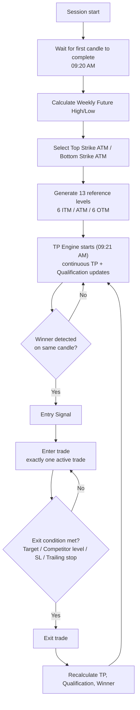
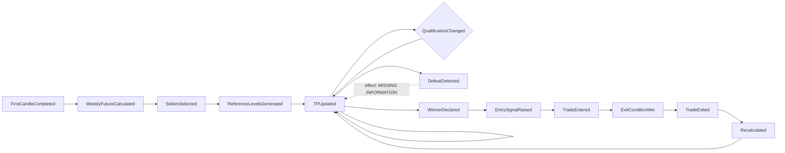
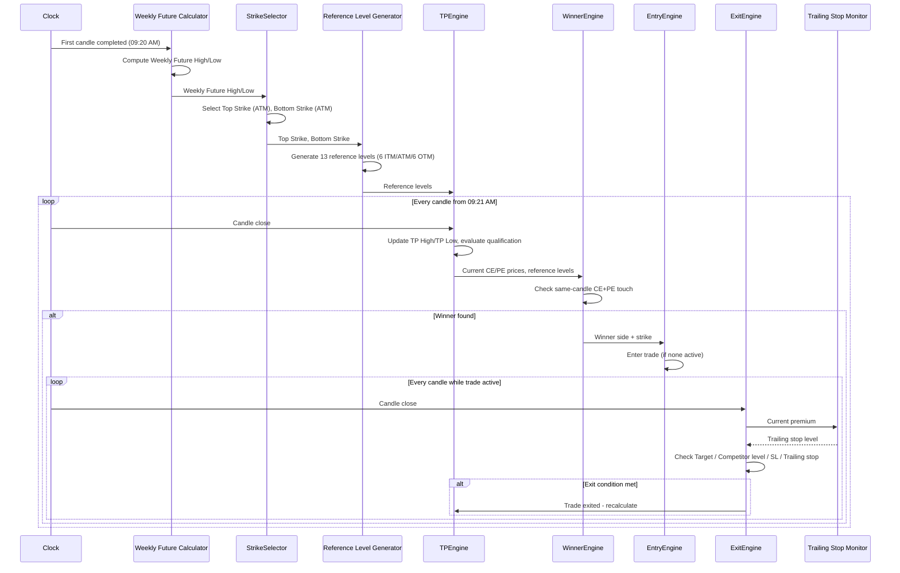

# Strategy Functional Specification

**Status:** Draft for engineering handoff — v1.1 (revised)
**Evidence sources for every rule in this document:**
1. User specification, dictated directly in chat, 2026-07-29 ("Senior Quant Architect" business-rules message) — the original rule set.
2. User revision, dictated directly in chat, 2026-07-29 ("Revise STRATEGY_FUNCTIONAL_SPECIFICATION.md using the following confirmed business rules") — 5 confirmed rules that resolve or narrow specific gaps from source 1, applied in this revision. Each resolved item below is marked **CONFIRMED (v1.1)** and cites which of the 5 rules resolved it.

This document does not draw on `research/transcripts/TR-001.md` or any other prior evidence source — it is a literal, non-inventive translation of the two chat messages above into specification form. Where TR-001.md or other repository documents cover related ground (e.g. Weekly Future, Strike selection) and appear to conflict or add detail neither message stated, that is noted but not merged in; reconciling the two evidence sources is out of scope for this document and is flagged in Section 20.
**Companion documents:** `research/specification/REALTIME_TRADING_SPECIFICATION.md` (Milestone K2, broader real-time workflow, separate evidence trail — not merged with this document per the user's own placement decision), `research/analysis/STRIKE_EVIDENCE_TABLE.md`, `research/analysis/WEEKLY_FUTURE_VERIFICATION.md` (TR-001-sourced Weekly Future evidence, found NOT READY — see Section 20). Note also `trading_engine/premium_snapshot/` (Milestone I2, already implemented) — an unrelated implementation milestone that happens to already capture "first 5-minute candle" OHLC per contract; see Section 6's note on the relationship.

**Reading this document:** every rule is stated in the user's own words wherever possible, followed by either a **CONFIRMED (v1.1)** note (resolved by the revision) or a **Missing Information** callout for anything neither source message specified. Nothing in this document should be treated as implementation-ready until every `MISSING INFORMATION` marker in Section 20 is resolved — per the user's own stated goal, that section should shrink to only true unknowns (e.g. the Weekly Future formula, the Stop Loss rule) before code generation begins.

---

## 1. Strategy Overview

An options strategy that, once per trading day:

1. Waits for the market's first candle to complete, then computes a Weekly Future High/Low and selects a Top Strike and a Bottom Strike (both "ATM" — see Section 5).
2. Builds a 13-level strike ladder (6 ITM, 1 ATM, 6 OTM) around those strikes, each level carrying CE High/Low and PE High/Low reference values.
3. Continuously evaluates, from 09:21 AM onward, whether the Top and Bottom strikes' CE/PE prices "qualify" against competitor levels (the **TP Engine**, Section 7) and whether any strike level has been breached (**Defeat**, Section 8's sibling concept — see note below).
4. On any candle where both a CE and a PE (of the same underlying evaluation) touch their own reference levels simultaneously, declares a **Winner** (Section 9) and immediately raises an **Entry Signal** (Section 10).
5. Manages exactly one open trade at a time, exiting on target, competitor-level breach, stop loss, or trailing stop (Section 11–13).
6. After every exit, recalculates TP/Qualification/Winner before permitting the next trade (Section 16).

**CONFIRMED (v1.1):** the "first candle" is the first **5-minute** candle, 09:15–09:20 (Rule 1). This resolves the candle-timeframe question for reference-level generation; it does not confirm the candle timeframe used by the Winner Engine's ongoing candle-by-candle evaluation (Section 9) or the TP Engine's continuous updates (Section 7) from 09:21 AM onward — those may or may not use the same 5-minute timeframe, and that is still unstated.

**MISSING INFORMATION:** the underlying instrument (index name, e.g. NIFTY/BANKNIFTY), the expiry convention (weekly/monthly), the trading session's start/end times beyond "09:20 AM" and "09:21 AM", and the candle timeframe used *after* 09:21 AM for Winner/TP evaluation (still unconfirmed — see above) are not stated anywhere in either source message.

---

## 2. Definitions

| Term | Definition (as given) | Missing Information |
|---|---|---|
| Weekly Future High / Low | Two values computed once, at 09:20 AM, after the first candle completes | Exact formula/inputs not stated (see Section 4) |
| Top Strike | The strike selected as "ATM" for the upper reference point | Selection rule beyond "ATM" not stated (see Section 5) |
| Bottom Strike | The strike selected as "ATM" for the lower reference point | Selection rule beyond "ATM" not stated (see Section 5); relationship between Top Strike and Bottom Strike (are they the same value, or two distinct ATM computations?) is unclear |
| Reference Level | A strike's CE High, CE Low, PE High, or PE Low value, used as Entry/Target/Support/Resistance depending on trade direction | **CONFIRMED (v1.1, Rule 1):** taken from the first 5-minute candle (09:15–09:20) — see Section 6. Role assignment (which value plays Entry/Target/Support/Resistance for a given strike/direction) — see Section 11, now largely resolved |
| TP (Target Price) | A dynamic, continuously-updating qualification value for Top Strike and Bottom Strike, starting at 09:21 AM | Exact numeric computation not stated (see Section 7) |
| Qualification | The state of a strike's TP "sustaining" against a competitor level, representing current market state, not a prediction | Precise sustain/breach test not fully specified — see Section 7 |
| Competitor | The opposite-side option (PE when evaluating CE, and vice versa) at a related strike, used both for Qualification and for Exit monitoring | **CONFIRMED (v1.1, Rule 2) for Exit monitoring**: for a Winner at strike S, Competitor Exit = PE(S-1) if Winner was CE, CE(S+1) if Winner was PE — see Section 11. **Still unresolved for TP Engine qualification** (Section 7) — Rule 2 is stated in terms of a Winner's entry strike S, not the pre-Winner Top/Bottom Strike qualification test, so it is not assumed to generalize there |
| Defeat | Any strike crossing any reference level | Whether this is a per-strike flag, a whole-ladder-invalidating event, or something else operationally is not stated (see Section 8) |
| Winner | The side (CE or PE) whose reference level is touched in the same candle as the opposite side's reference level, with the opposite side then declared the loser | **CONFIRMED (v1.1, Rule 3):** the both-sides-touch-simultaneously scenario that would require a tie-break does not occur; no tie-break logic exists or is needed (see Section 9) |
| Entry Signal | Raised immediately upon Winner determination | — |
| Target | The next reference level in the direction of the trade (example: Entry 24100 CE → Target 24150 CE) | **CONFIRMED (v1.1, Rule 2)**: for Winner CE at strike S, Target = CE(S+1); for Winner PE at strike S, Target = PE(S-1) — see Section 11 |
| Support | The reference level below the entry strike (mirrored as Resistance for PE) | **CONFIRMED (v1.1, Rule 2)**: for Winner CE at strike S, Support = CE(S-1); for Winner PE at strike S, Support = PE(S+1) — see Section 11 |
| Trailing Stop | A stop that must guarantee a minimum net +3 premium points after brokerage/exchange charges/tax | Trailing mechanics (activation trigger, step size, trail distance) are not stated beyond the minimum-net-profit guarantee (see Section 13) |

---

## 3. Trading Lifecycle

**MISSING INFORMATION:** what happens between session start and 09:20 AM (is there a pre-market phase, and does the strategy do anything with it?); what ends a trading day/session (a fixed close time, forced square-off, or the strategy simply stops evaluating); whether the lifecycle in this document repeats identically every trading day with fresh Weekly Future/strike selection, or whether any state carries over.

---

## 4. Weekly Future Calculation

**As stated:** "Wait until the first candle completes. Time: 09:20 AM. Calculate Weekly Future High. Weekly Future Low."

That is the complete content of the source message on this topic — no formula, no inputs, no worked example.

**CONFIRMED (v1.1, Rule 1):** the "first candle" referenced here is the first 5-minute candle, 09:15–09:20 (same candle Section 6's reference levels are taken from). This confirms *which* candle, not the formula applied to it.

**MISSING INFORMATION:**
- The formula for Weekly Future High and Weekly Future Low.
- What data feeds the formula (the first candle's own OHLC? a weekly futures instrument's own price? something else?).
- Why two values ("High" and "Low") are produced from what appears to be a single first candle.
- Whether this repeats weekly, daily, or is a once-per-week computation reused across multiple days.

**Cross-reference note (not part of this document's evidence, informational only):** `research/analysis/WEEKLY_FUTURE_VERIFICATION.md` (Milestone E1, sourced from `research/transcripts/TR-001.md`) previously investigated a "Weekly Future" concept in this codebase and found its only worked example internally self-contradictory (conflicting Low values, Low exceeding High), rating that evidence source NOT READY. This document's Weekly Future concept comes from a different evidence source (this chat message) and has not been reconciled with TR-001.md's version. Do not assume the two describe the same computation without explicit confirmation from you.

---

## 5. Strike Selection

**As stated:** "Select Top Strike (ATM). Bottom Strike (ATM)."

**MISSING INFORMATION:**
- What "ATM" is computed against (Weekly Future High for Top Strike, Weekly Future Low for Bottom Strike? spot price? something else?).
- The strike-rounding rule (nearest 50? nearest 100? depends on instrument?).
- Whether Top Strike and Bottom Strike can ever be equal, and what happens if so.
- Whether strike selection happens once (at 09:20 AM) or is re-evaluated intraday.

---

## 6. Reference Level Generation

**As stated:**

> Generate 13 strike levels: ATM, 6 ITM, 6 OTM.
> Example: 24250, 24200, 24150, 24100, 24050, 24000, ...
> Each strike has CE High, CE Low, PE High, PE Low.
> Each strike behaves as Entry, Target, Support, Resistance depending on trade direction.

| Property | As stated | Missing Information |
|---|---|---|
| Ladder size | 13 levels total (6 ITM + 1 ATM + 6 OTM) | — |
| Ladder step | Example shows 50-point spacing (24250, 24200, ...) | Confirmed as a fixed step, or example-only? Step size for other instruments/strike ranges not stated |
| Ladder center | Implied to be centered on "ATM" | Is the ladder built once around the Section 5 ATM strike(s), separately for Top Strike and Bottom Strike, or is there one shared ladder? Not stated |
| CE High / CE Low / PE High / PE Low per strike | **CONFIRMED (v1.1, Rule 1):** taken from the first 5-minute candle (09:15–09:20) — i.e. for each strike's CE contract, CE High/CE Low are that contract's own High/Low over that one candle; PE High/PE Low are the PE contract's High/Low over the same candle | Computed once at 09:20 and held fixed thereafter, or eligible for recalculation — not stated (Section 3's lifecycle implies "generated" once, before the 09:21 AM TP Engine start, but this is not explicit) |
| Role assignment (Entry/Target/Support/Resistance) | Stated to depend on "trade direction" | **CONFIRMED (v1.1, Rule 2)** for the post-Winner Entry/Target/Support roles — see Section 11. Role assignment *before* a Winner is declared (i.e. what a level "is" while only being monitored by the TP Engine) is not separately named and is not assumed to need one |

**Note on relationship to `trading_engine/premium_snapshot/`:** this repository already contains an implemented, unrelated milestone (I2) that captures exactly "first 5-minute candle (09:15–09:20) OHLC per option contract" — see `trading_engine/premium_snapshot/premium_snapshot_engine.py`'s `PremiumSnapshotEngine` and `ContractSnapshot` (open/high/low/close/LTP/volume/OI per contract). Rule 1 here describes the same underlying market observation (first-5-minute-candle OHLC), but this document does not assume `ContractSnapshot.high`/`.low` are *the same field* as "CE High"/"CE Low" without your explicit confirmation — flagged in Section 20 as a reconciliation item, not assumed.

**Remaining gap:** whether the ladder step size (Section 6's own "Ladder step" row above) and ladder center (Top Strike vs. Bottom Strike vs. one shared ladder) are still open, unaffected by this revision.

---

## 7. TP Engine

**As stated:**

> TP starts updating after 09:21 AM. TP is dynamic. TP changes continuously. TP is NOT fixed.
>
> **TP High** (Top Strike): CE > competitor PE Low; PE < competitor CE High. If market currently sustains without touching competitor PE Low, TP High qualifies.
>
> **TP Low** (Bottom Strike): CE > competitor PE High; PE < competitor CE Low. If market currently sustains, TP Low qualifies.
>
> Qualification is NOT future prediction. Qualification represents the current market state. News/Budget/War/Natural Disaster may invalidate any qualification. Never assume qualification is permanent.

| Rule element | As stated | Missing Information |
|---|---|---|
| TP High qualification test | `Top Strike CE > competitor PE Low` AND `Top Strike PE < competitor CE High`, sustained (not yet touching competitor PE Low) | Which strike is "competitor" for Top Strike is not named explicitly — inferred by analogy with Section 11's worked example to be an adjacent strike, but not confirmed |
| TP Low qualification test | `Bottom Strike CE > competitor PE High` AND `Bottom Strike PE < competitor CE Low`, sustained | Same competitor-identity gap as above |
| Update cadence | "Continuously," starting 09:21 AM | Candle-by-candle? Tick-by-tick? Not stated |
| "Sustains" | Implied to mean "has not yet breached the competitor level" | No formal breach/touch definition given beyond this |
| External invalidation (news/budget/war/disaster) | Explicitly named as able to invalidate qualification at any time | No detection mechanism is specified — this reads as a disclaimer/warning to the implementer, not an implementable rule, unless further specified |

**MISSING INFORMATION:** the identity of "competitor" strike/level for both TP High and TP Low is still not defined generally. The v1.1 revision (Rule 2) confirmed a competitor mapping, but explicitly for a **Winner's** entry strike S (`Competitor Exit = PE(S-1)` for Winner CE, `CE(S+1)` for Winner PE) — a post-Winner, Exit-Engine concept (Section 11). TP High/TP Low's competitor (a pre-Winner, Top-Strike/Bottom-Strike qualification concept) is not stated to use the same S±1 pattern, and this document does not assume it does. There is also still no numeric definition of "TP" itself (a price? a boolean qualified/not-qualified flag? both rules given are boolean conditions, yet the engine is named "TP" as if it produces a price) — clarify whether "TP" is a qualification flag, a target price, or both.

---

## 8. Qualification Engine

Covered jointly with Section 7 above, since the source message did not separate "TP" and "Qualification" into two distinct rule sets — "TP qualifies" is the only qualification concept given. This section is retained to match the required 20-section document structure.

**MISSING INFORMATION:** whether Qualification is a separate, independently-computed engine from TP, or simply the boolean outcome of the TP sustain test described in Section 7. The source message uses "TP" and "qualification" interchangeably.

---

## 9. Winner Engine

**As stated:**

> Winner is evaluated candle by candle. If CE touches any one of its reference levels AND PE touches any one of its reference levels during the SAME candle, then one side wins, the opposite side loses. Winner immediately generates Entry Signal. Multiple touches do not occur. Ignore such logic.

| Rule element | As stated | Missing Information |
|---|---|---|
| Evaluation cadence | Candle by candle | Candle timeframe not stated (see Section 1) |
| Trigger condition | CE touches one of its reference levels AND PE touches one of its reference levels, same candle | "CE" and "PE" here — of which strike(s)? Top Strike's CE/PE? Every strike's CE/PE simultaneously? Not stated |
| Winner determination | "One side wins, the opposite side loses" | **CONFIRMED (v1.1, Rule 3):** the scenario requiring a tie-break (multiple simultaneous winner candidates) does not occur in practice; no tie-break logic exists or should be implemented. The implementer should trust that exactly one side's touch is ever the operative one per candle, per the business rule, rather than defensively coding a tie-break |
| Multiple touches | Explicitly stated not to occur; "ignore such logic" | Directly stated — no gap; reinforced by Rule 3's near-identical "multiple winner scenarios do not occur" statement in the v1.1 revision |
| Output | Entry Signal, immediately | — |

**Resolved (v1.1):** the winner-selection tie-break question raised in the original draft is now explicitly closed — Rule 3 confirms the both-sides-touch-simultaneously case does not occur, and instructs against inventing tie-break logic. No further engineering decision is needed here.

---

## 10. Entry Engine

**As stated:**

> Immediately after Winner. Only ONE trade may remain active. Never take another trade until current trade exits.

**CONFIRMED (v1.1, Rule 4):** "Only one trade may be active at any time. Ignore all new entry signals until the active trade exits." — this reaffirms and sharpens the original rule: while a trade is active, any Winner/Entry Signal produced by the Winner Engine (Section 9) is explicitly ignored, not queued or deferred, and no state is retained about the ignored signal.

| Rule element | As stated | Missing Information |
|---|---|---|
| Timing | Immediately after Winner Engine declares a winner | — |
| Position limit | Exactly one active trade at any time; new signals during an active trade are ignored outright (v1.1, Rule 4) | — |
| Entry price | Not stated | Market order at signal candle close? Limit at reference level? Not stated |
| Entry side | The winning side (CE or PE) from Section 9 | — |
| Entry strike | The strike whose reference level was touched (per Section 11's worked example) | — |

---

## 11. Exit Engine

**As stated (Target sub-section):**

> Example: Winner 24100 CE. Entry 24100 CE. Target 24150 CE. Support 24050 CE. Mirror logic for PE.

**As stated (Exit sub-section):**

> Exit when: Target Hit OR Competitor Strike Reference Level Hit OR Stop Loss OR Trailing Stop.
>
> Competitor Exit Example: Trade 24100 CE. Monitor 24050 PE OPTION. When 24050 PE option reaches its own reference level, exit immediately. Mirror for PE.

### CONFIRMED (v1.1, Rule 2): general competitor/Target/Support mapping

For a Winner at strike **S** (any strike in the ladder, not just the 24100 example):

| Winner side | Entry | Target | Support | Competitor Exit |
|---|---|---|---|---|
| CE | S | CE(S+1) | CE(S-1) | PE(S-1) |
| PE | S | PE(S-1) | PE(S+1) | CE(S+1) |

Where `S+1`/`S-1` denote the next strike up/down in the 13-level ladder (Section 6). This table replaces the original worked-example-only rule and is now the general rule for every strike, not just 24100. It is consistent with the original worked example: Winner CE at 24100 → Target CE(24150)=S+1 ✓, Support CE(24050)=S-1 ✓, Competitor Exit PE(24050)=PE(S-1) ✓.

| Rule element | As stated | Status |
|---|---|---|
| Target (CE) | Entry S CE → Target = CE(S+1) | **CONFIRMED (v1.1)** — general rule, see table above |
| Support (CE) | Entry S CE → Support = CE(S-1) | **CONFIRMED (v1.1)** |
| Target (PE) | Entry S PE → Target = PE(S-1) | **CONFIRMED (v1.1)** — mirrors CE as expected, now explicit rather than inferred |
| Support (PE) | Entry S PE → Support = PE(S+1) | **CONFIRMED (v1.1)** |
| Competitor monitored during a trade | Winner CE at S → monitor PE(S-1); Winner PE at S → monitor CE(S+1) | **CONFIRMED (v1.1)** — general rule, see table above |
| Competitor exit trigger | "When [competitor] option reaches its own reference level" | Which of the competitor's 2 reference levels (its own High or Low) triggers this is still not stated |
| Stop Loss | Named as an exit condition | **Still not stated at all**: SL price, SL basis (premium points? percentage? underlying-level?), or SL placement rule |
| Trailing Stop | Named as an exit condition | See Section 13 |
| Exit priority | Four conditions listed with "OR" | Still not stated: if multiple conditions are met in the same candle, no priority/precedence order is given |

**MISSING INFORMATION:** the Stop Loss rule is entirely unstated (name only, no value or basis); exit-condition precedence when multiple trigger simultaneously; which of the competitor's own two reference levels (High or Low) is the trigger for a competitor exit — Rule 2 names the competitor *strike/side*, not which of its two levels.

---

## 12. Trailing Stop

Covered in Section 13 per the source rule set's own structure (the source message places "Trailing Stop" as its own section, separate from the general Exit section). Section 12 is retained here only to preserve the required 20-section numbering — its content is Section 13.

---

## 13. Trailing Stop (rule content)

**As stated:**

> Trailing stop must guarantee minimum +3 premium points to cover brokerage, exchange charges, tax. Net exit should remain positive.

| Rule element | As stated | Missing Information |
|---|---|---|
| Minimum net guarantee | +3 premium points, net of brokerage/exchange charges/tax | The brokerage/exchange charge/tax figures themselves (fixed amount? percentage? per-lot?) are not stated, so "+3 net" cannot be computed without them |
| Trail activation | Not stated | At what profit level does trailing begin? |
| Trail step/distance | Not stated | How far does the stop trail behind the current price, and by what increment? |
| Interaction with Target/Competitor-exit/SL | Not stated | If trailing stop and target (or competitor exit) would trigger on the same candle, which takes precedence? |

**MISSING INFORMATION:** every mechanical detail of the trailing stop beyond its minimum-net-profit guarantee.

---

## 14. Defeat Engine

**As stated:** "Defeat means any strike crosses any reference level."

| Rule element | As stated | Missing Information |
|---|---|---|
| Trigger | Any strike crosses any reference level | Which reference level — the strike's own CE/PE High/Low, or another strike's? "Any" reads as unrestricted, but that reading is not confirmed |
| Effect of Defeat | Not stated | Does Defeat invalidate that strike's Qualification (Section 7)? Remove it from the active ladder? Trigger an exit if a trade is open on that strike? None of this is stated |
| Relationship to Winner/Entry/Exit | Not stated | Is Defeat a precondition that prevents a strike from becoming a Winner, or an independent, always-on invalidation signal? |

**MISSING INFORMATION:** the entire operational consequence of a Defeat event — the source message defines only the trigger condition, never the effect.

---

## 15. Trade State Machine

Derived from the stated lifecycle (Sections 3, 9, 10, 11, 16). States and transitions below are the minimum implied by the text; anything beyond this minimum (e.g. a distinct "Qualified" vs "Unqualified" sub-state machine for TP, or a distinct state for "Defeated" strikes) is not explicit in the source and is flagged in Section 20 rather than invented here.

```mermaid
stateDiagram-v2
    [*] --> WaitingForFirstCandle
    WaitingForFirstCandle --> WeeklyFutureCalculated: 09:20 AM, first candle completes
    WeeklyFutureCalculated --> StrikesSelected: Top/Bottom Strike selected (ATM)
    StrikesSelected --> LadderGenerated: 13 reference levels generated
    LadderGenerated --> Monitoring: 09:21 AM, TP Engine starts
    Monitoring --> Monitoring: TP/Qualification update, no Winner yet
    Monitoring --> WinnerDeclared: CE + PE touch reference levels, same candle
    WinnerDeclared --> TradeActive: Entry Signal -> trade entered
    TradeActive --> TradeActive: no exit condition met
    TradeActive --> TradeExited: Target Hit / Competitor Level Hit / Stop Loss / Trailing Stop
    TradeExited --> Monitoring: Recalculate TP, Qualification, Winner
```

**MISSING INFORMATION:** whether `Monitoring` ever exits without a trade (e.g. at session end with no Winner ever declared) and what state that leads to; whether a `Defeat` event (Section 14) constitutes its own state or transition; whether `WeeklyFutureCalculated`/`StrikesSelected`/`LadderGenerated` recur within a single day or only once.

---

## 16. Data Models

Field lists below are limited to what the source message names explicitly. Types, units, and precision are not stated anywhere in the source and are left blank/MISSING rather than assumed.

### WeeklyFuture
| Field | Description | Type/Unit |
|---|---|---|
| high | Weekly Future High | MISSING INFORMATION |
| low | Weekly Future Low | MISSING INFORMATION |
| calculated_at | 09:20 AM, first-candle completion | MISSING INFORMATION (date/session tagging not stated) |

### StrikeSelection
| Field | Description | Type/Unit |
|---|---|---|
| top_strike | ATM strike derived from Weekly Future (relationship unconfirmed) | MISSING INFORMATION |
| bottom_strike | ATM strike derived from Weekly Future (relationship unconfirmed) | MISSING INFORMATION |

### ReferenceLevel (one per strike in the 13-level ladder)
| Field | Description | Type/Unit |
|---|---|---|
| strike | Strike price | MISSING INFORMATION (numeric type/precision) |
| ce_high | CE High reference value | **CONFIRMED (v1.1):** CE contract's High over the first 5-minute candle (09:15–09:20) |
| ce_low | CE Low reference value | **CONFIRMED (v1.1):** CE contract's Low over the first 5-minute candle |
| pe_high | PE High reference value | **CONFIRMED (v1.1):** PE contract's High over the first 5-minute candle |
| pe_low | PE Low reference value | **CONFIRMED (v1.1):** PE contract's Low over the first 5-minute candle |
| role | Entry / Target / Support / Resistance, direction-dependent | **CONFIRMED (v1.1)** for the post-Winner case — see `Trade.target_level`/`support_level`/`competitor_monitor_strike` below and Section 11's table |

### TPState (per Top Strike, Bottom Strike)
| Field | Description | Type/Unit |
|---|---|---|
| qualified | Boolean — currently sustaining vs. competitor level | — |
| competitor_strike | The strike whose PE/CE the qualification test compares against | MISSING INFORMATION (identity rule) |
| last_updated | Timestamp of last continuous update | MISSING INFORMATION (update cadence) |

### WinnerEvent
| Field | Description | Type/Unit |
|---|---|---|
| candle_timestamp | The candle on which both CE and PE touched their reference levels | MISSING INFORMATION (candle timeframe) |
| winning_side | CE or PE | MISSING INFORMATION (selection rule when both touch) |
| winning_strike | The strike associated with the winning side | — |

### Trade
| Field | Description | Type/Unit |
|---|---|---|
| entry_strike | Strike entered | — |
| entry_side | CE or PE | — |
| entry_price | Not stated | MISSING INFORMATION |
| target_level | CE(S+1) if Winner CE, PE(S-1) if Winner PE | **CONFIRMED (v1.1)** — see Section 11 table |
| support_level | CE(S-1) if Winner CE, PE(S+1) if Winner PE | **CONFIRMED (v1.1)** — see Section 11 table |
| competitor_monitor_strike | PE(S-1) if Winner CE, CE(S+1) if Winner PE | **CONFIRMED (v1.1)** — see Section 11 table; which of the competitor's own High/Low triggers exit is still MISSING INFORMATION |
| stop_loss | Not stated at all | MISSING INFORMATION |
| trailing_stop_state | Minimum +3 net premium points guarantee | MISSING INFORMATION (activation/step mechanics) |
| exit_reason | Target Hit / Competitor Level Hit / Stop Loss / Trailing Stop | — |

### DefeatEvent
| Field | Description | Type/Unit |
|---|---|---|
| strike | The strike that crossed a reference level | — |
| crossed_level | The reference level crossed | MISSING INFORMATION (which strike's level) |
| effect | Consequence of the crossing | MISSING INFORMATION (entirely unstated, see Section 14) |

---

## 17. Event Flow

**MISSING INFORMATION:** whether `DefeatDetected` (E7) can occur concurrently with an open trade and, if so, whether it forces an exit — see Section 14.

---

## 18. Sequence Diagram

**MISSING INFORMATION:** exact message contents/parameters passed between engines (e.g. what "current CE/PE prices" specifically includes) are illustrative only, not specified by the source message.

---

## 19. Edge Cases

The source message does not enumerate edge cases explicitly. The list below names edge cases implied by the stated rules, each marked with what the source does and does not resolve.

| Edge case | Source message coverage |
|---|---|
| Both CE and PE touch reference levels in the same candle | **Resolved (v1.1):** confirmed this does not occur; no tie-break rule needed — see Section 9 |
| A strike is "Defeated" (Section 14) while it is also the current TP-qualified strike | Not resolved — no stated interaction between Defeat and Qualification |
| A strike is "Defeated" while a trade is open on it | Not resolved — no stated interaction between Defeat and an open Trade |
| Multiple touches within a single candle ("multiple touches do not occur") | Explicitly dismissed by the source ("ignore such logic") — treated as an assumption, not a gap |
| Target Hit and Competitor Level Hit occur in the same candle | Not resolved — no exit-priority rule given |
| Trailing Stop and Stop Loss would both trigger in the same candle | Not resolved — no exit-priority rule given |
| No Winner is ever declared during a trading session | Not addressed — no stated end-of-day behavior |
| Weekly Future High/Low calculation itself fails or produces an invalid range (e.g. Low > High) | Not addressed by the source message (see Section 4's cross-reference note regarding TR-001.md's own finding of exactly this failure mode) |
| News/Budget/War/Natural Disaster invalidates Qualification mid-trade | Source explicitly warns this can happen but gives no detection or response mechanism |
| A new Winner/Entry Signal occurs while a trade is already active | **Resolved (v1.1):** explicitly ignored, not queued — see Section 10 |

---

## 20. Missing Information

Consolidated list of every gap remaining after the v1.1 revision, for engineering triage. Nothing in this specification should be treated as build-ready until each of these is resolved by you (the domain owner) or a further evidence source you designate. Five items from the original v1.0 list were resolved by the v1.1 revision and are listed separately below, not repeated here.

### Critical (blocks nearly everything downstream)
1. Weekly Future High/Low formula and inputs (Section 4) — *which* candle feeds it is now confirmed (v1.1), the formula itself is not.
2. ATM strike-selection rule for Top Strike and Bottom Strike (Section 5).
3. Identity rule for "competitor strike/level" in **TP Engine qualification** specifically (Section 7) — the Exit Engine's competitor mapping was resolved in v1.1, but that resolution was stated in terms of a Winner's entry strike, not the pre-Winner Top/Bottom Strike TP test, and is not assumed to carry over.
4. Stop Loss rule — not stated at all (Section 11).
5. Operational effect of a Defeat event (Section 14).

### High (needed for correct behavior, not just edge cases)
6. Underlying instrument and expiry convention (Section 1).
7. Candle timeframe used by the Winner Engine and TP Engine from 09:21 AM onward (Section 1, 7, 9) — only the reference-level candle (first 5-minute, 09:15–09:20) is confirmed; whether ongoing evaluation also runs on 5-minute candles is not stated.
8. Which of the competitor's own two reference levels (High or Low) triggers a competitor exit (Section 11) — v1.1 confirmed *which strike/side* is the competitor, not which of its two levels.
9. Trailing Stop activation trigger and trail step/distance (Section 13).
10. Brokerage/exchange charge/tax figures needed to compute the "+3 net" guarantee (Section 13).
11. Exit-condition precedence when Target/Competitor/SL/Trailing Stop trigger simultaneously (Section 11, 13, 19).
12. TP/Qualification update cadence — tick or candle (Section 7).

### Medium
13. Whether "TP" is a price, a boolean qualification flag, or both (Section 7).
14. Reference-level ladder step size for instruments/ranges beyond the one example (Section 6).
15. End-of-session behavior when no Winner is ever declared (Section 3, 19).
16. Whether Weekly Future/Strike Selection/Ladder Generation recur intraday or only once per day (Section 3, 15).
17. Whether CE/PE High/Low reference values (now confirmed as first-5-minute-candle OHLC) are held fixed for the rest of the session or ever recalculated (Section 6).

### Reconciliation (out of scope for this document, flagged for awareness)
18. This document's Weekly Future/Strike concepts have not been reconciled against `research/transcripts/TR-001.md`'s own Weekly Future evidence, which a prior milestone (`WEEKLY_FUTURE_VERIFICATION.md`) rated NOT READY due to an internally self-contradictory worked example. Confirm whether these are the same concept before implementation begins.
19. Whether "CE High/Low, PE High/Low taken from the first 5-minute candle" (this document's Rule 1) refers to the same underlying data as the already-implemented `trading_engine/premium_snapshot/` package's `ContractSnapshot.high`/`.low` (Milestone I2) — plausible given both describe first-5-minute-candle OHLC per contract, but not confirmed by you and therefore not assumed.

### Resolved in v1.1 (retained here only as a changelog, not open items)
- CE High / CE Low / PE High / PE Low computation — resolved: first 5-minute candle (09:15–09:20) OHLC per contract (Rule 1).
- General Target/Support/Competitor-Exit mapping as a function of entry strike S, both CE and PE — resolved (Rule 2).
- Winner tie-break rule — resolved: the scenario does not occur, no tie-break logic needed (Rule 3).
- Single-active-trade / ignore-new-signals behavior — reaffirmed explicitly (Rule 4), no material change from v1.0.
- Post-exit recalculation of TP/Qualification/Winner before the next trade — reaffirmed explicitly (Rule 5), no material change from v1.0.
